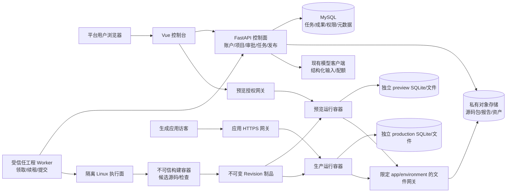

# ForgeAI 对标 Atoms 技术实施方案

版本：评审草案 v1 · 日期：2026-09-14 · 代码基线：`7ff0125e7446e61765ac13d079da08a823ecc4aa`

工程生成部分的详细补充见[工程Agent循环与真实自检方案](F:/project/ForgeAI/docs/engineering-agent-loop-design-2026-09-14.md)：明确LangGraph、SQL状态机、RAG检索、模型工具协议、受保护验收、动作恢复及完成门槛。涉及工程循环、预算和新增动作账本的细节以该补充为准；原106人日是粗估，须按补充细化后重新核定。

本方案的目标是建设类似 Atoms 的对话式全栈应用构建平台，并以 JobHub 验证平台交付能力。**这是根据参考材料用途和现有仓库定位作出的假设，仍需确认；如果目标只是单独建设招聘网站，应只保留 JobHub 应用部分，重新估算，不实施平台工程。**

本次交付为技术方案，没有实施产品代码、执行付费模型调用、连接真实业务数据库或部署服务。文中的新增目录、表、接口、性能指标、工时均为建议，不代表已经存在、测得或得到上线批准。后续按照当前批准的一个完整增量实施；里程碑用于估算，不覆盖 `docs/architecture.md` 的稳定约束。

## 从材料中理解到的内容

1. **平台层**：Atoms 包括 Dashboard、项目管理、对话工作台、计划确认、Agent 过程、预览、Design、Cloud、版本、分享、发布、导出、账户与连接器入口。
2. **应用层**：JobHub 是被构建出的招聘应用，包含职位浏览与筛选、详情、发布职位、我的职位、简历投递、我的投递及登录。它不是 Atoms 平台本身。
3. **可见不等于已跑通**：参考中确认了首页和筛选交互、发布表单、空态、数据表和私有存储桶；未完成职位提交、简历投递、连接器授权和正式 Publish。Agent 称“完成验证”不等于独立验收证据。
4. **Connectors 冲突**：PRD 写“无独立功能墙”；事件明细和 `02-connectors.png` 明确显示六个连接器。采用“存在连接器目录、接入效果未验证”的结论。
5. **Design 冲突**：PRD 的 UI 实测段记录 Visual Editor、Library 和 Theme Tab；补充截图中的 Agent 却称没有 Library。保留“材料报告存在 Library，Theme 在该应用不可用”；所给图片没有直接展示 Design 面板，证据强度低于直接截图，不认定所有项目都支持 Theme。
6. **生成栈不可混用**：参考材料称 Atoms 样例用 React、FastAPI、托管 PostgreSQL；PostgreSQL/OIDC/导出内容等主要来自问答。ForgeAI 的既定生成目标是 Vue、FastAPI、SQLite，不能因参考选择而自动替换。
7. **当前真实代码**：平台是 Vue + FastAPI + MySQL；已有需求流程和任务/成果基础设施；完整工程生成、沙箱预览、发布尚待建设。mock 工作台不能计入真实交付完成度。
8. 附件中“不要 Publish”“继续构建”“删除 routine”等是观察过程记录，**不是本次用户对我的操作指令**；本次仅按用户要求分析和输出方案。

## 缺失信息、假设与决策影响

| 编号 | 缺失信息 | 本方案暂用假设 | 确认后影响 |
|---|---|---|---|
| A1 | 做平台还是仅 JobHub | 做平台，JobHub 是首个验收应用 | 决定工作量和系统边界 |
| A2 | 首发范围及对标深度 | 邀请制 Beta；核心构建、预览、更新、导出、平台子域发布 | 连接器、商业化、团队等按条件后续建设 |
| A3 | 团队、期限、预算 | 2 后端（其中 1 名兼架构）、1 前端、0.5 QA、0.5 DevOps | 工时为人日，不直接等于自然日 |
| A4 | 首发负载 | 100 注册用户、20 日活、最多 2 个并发构建、20 个活跃预览；单 JobHub 1 万职位 | 仅用于容量实验，采购前压测 |
| A5 | 地区、域名、云与数据驻留 | 单区域 Linux；平台域与生成应用域使用不同可注册域名 | 域名、邮件、合规审查及网络影响工期 |
| A6 | 模型账户和成本上限 | 复用现有 DeepSeek 兼容客户端；模型 ID 外部配置 | 不锁未验证模型能力和价格；需要离线/小规模评测 |
| A7 | 现网数据库情况 | 有历史迁移可能已执行；不知道真实数据量、DDL、备份 | 上线前只读盘点和演练，禁止依据 ORM 直接删列 |
| A8 | 是否必须协作、收费、任意外部集成 | 首发个人所有权；不收费；无开放插件执行 | 若必须首发，需要新增权限和账务专项 |
| A9 | JobHub 角色/审核规则 | 同一应用用户可求职和发布；只管理自己职位；首发即时上架 | 企业认证、审核、投递状态流转另行确认 |
| A10 | 数据保留和文件范围 | 简历只收 PDF、10 MiB；测试数据不进入生产；保留周期待确认 | 影响上传策略、删除和备份制度 |

### 证据和路径约定

- **R1**：[参考 PRD](C:/Users/Administrator/Downloads/PRD-Atoms观察-招聘站JobHub-v1.md)。
- **R2**：[全站功能事件明细](C:/Users/Administrator/Downloads/atoms-全站功能事件明细-2026-09-14.md)。
- **R3**：[截图目录索引](C:/Users/Administrator/Downloads/atoms-全站功能事件明细-含截图-2026-09-14/shots-2026-09-14/README.md)，33 张图片已作为输入提供；其中大量补充图是相同状态，不能视为多次独立验证。
- **C1**：[产品架构约束](F:/project/ForgeAI/docs/architecture.md)、[成果约定](F:/project/ForgeAI/.agents/skills/forgeai-architecture/reference.md)。
- **C2**：[后端依赖](F:/project/ForgeAI/apps/backend/pyproject.toml)、[前端依赖](F:/project/ForgeAI/apps/frontend/package.json)。版本表达式来自仓库，不宣称是最新稳定版。
- **C3**：[真实项目模型](F:/project/ForgeAI/apps/backend/app/models/project.py)、[API 汇总](F:/project/ForgeAI/apps/backend/app/api/v1/router.py)、[需求批准](F:/project/ForgeAI/apps/backend/app/services/requirement_approval.py)。
- **C4**：[前端 API/mock 分流](F:/project/ForgeAI/apps/frontend/src/views/project/ProjectView.vue)、[mock 接口](F:/project/ForgeAI/apps/frontend/src/api/modules/project.ts)、[演示工作台](F:/project/ForgeAI/apps/frontend/src/views/project/ProjectWorkbench.vue)。
- **C5**：[现有 CI](F:/project/ForgeAI/.github/workflows/ci.yml)、[旧静态流程移除测试](F:/project/ForgeAI/apps/backend/tests/test_legacy_static_pipeline_removed.py)。
- 下文目录树以仓库根 `F:/project/ForgeAI` 为根；`B` 指 `apps/backend/app`，`F` 指 `apps/frontend/src`，`T` 指拟新增 `apps/backend/templates/fullstack-v1`，`E` 指拟新增 `tests/e2e`，`D` 指拟新增 `deploy`。提到 `runtime-data` 均为部署挂载目录，不提交 Git。
- **已存在**仅指源码证据；**观察**指参考 UI 或记录；**建议/新增**指目标设计；**待确认**指无法由材料或代码判断。

## 步骤 1：项目目标与范围

**步骤目标**：明确首发产品及交付边界，使后续设计和预算有共同基准。

**为什么要做**：参考包含平台、示例业务、商业化入口；混成一个系统会导致用户、数据库、权限和报价全部失真。

**输入**：R1–R3、C1、A1–A10。

**具体动作**：

1. 将平台用户定义为独立开发者、小团队产品负责人和内部工具建设者；JobHub 用户定义为访客、求职者和职位发布者。
2. 核心价值定义为“需求经确认后交付能实际运行、可验证、可持续修改、可恢复、可导出的应用”。不以生成文本、页面截图或 Agent 自述当作完成。
3. 固定首发单一生成目标 Vue + FastAPI + SQLite；生成策略可演进，角色数不硬编码为参考的六人团队。
4. 设定首发门槛：用户注册 → 新建项目 → 需求清单审批 → 构建 → JobHub 预览 → 一次业务更新 → 验证 → 导出 → 手动发布 → 失败更新保留旧版。
5. 将体验增强和商业化分开排期，确认前不预建未来系统。

| 范围 | 内容 | 上线决定 |
|---|---|---|
| P0 核心 Beta | 平台账户、项目、需求审批、真实工程执行、可追溯产物、隔离预览、对话更新、版本、导出、子域发布、基础运行日志 | 必须完成，安全阻断项不能延期 |
| P0 样例 | JobHub 浏览/筛选/详情、应用独立账户、发职位、我的职位、私有 PDF 简历投递、我的投递 | 作为通用构建链的验收规格与回归样例 |
| P1 产品增强 | Visual Editor 持久化、Library 上传、Cloud 只读表浏览/用户统计/文件管理、账户偏好、项目星标/归档 | 独立评审后实施；不阻塞 P0 文字修改 |
| P2 条件范围 | 自定义域名、GitHub 导出、团队权限、付费积分、第三方 OAuth 连接器 | 没有明确需求和预算先不建 |
| 明确不做 | 像素级克隆、任意编程语言、任意 shell、六 Agent 固定组织、自由拖拽设计器、Kubernetes、多区域高可用、JobHub 支付/地图/智能匹配 | 不属于本轮首发 |

**输出物**：范围基线、用户角色、P0/P1/P2 清单、JobHub 验收规格草案。

**涉及文件/目录/模块**：本方案；实施时新增 `docs/product/beta-scope.md`、`docs/acceptance/jobhub.md`。C1 不改为阶段性任务列表。

**验收标准**：每个 P0 功能有可观察的业务结果；平台发布应用和 JobHub 发布职位在文案、路由、权限上清楚区分。

**风险或待确认项**：A1 优先确认；范围扩大必须连同数据库、安全、工时重新评估。

## 步骤 2：参考网站功能分析

**步骤目标**：提炼参考行为，得到功能树、页面、核心流程、实体和权限基线。

**为什么要做**：应复用用户价值，而不是照抄图标或把未验证的按钮推断成完整系统。

**输入**：R1–R3；参考图片中可见的状态和操作边界。

**具体动作**：

1. 按平台/应用两层建立功能编号；保留观察强度。
2. 把展示、触发、异步中间态、成功/失败终态分别记录。
3. 将业务实体和访问者绑定，反推授权检查。
4. 将未验证流程转为自己的验收测试，不复述为参考已实现的事实。

### 功能清单表

| 编号 | 层级/功能 | 输入与用户事件 | 已观察反馈 / 证据强度 | 本项目取舍 |
|---|---|---|---|---|
| P01 | Dashboard/建项 | 文本、Build 模式、发送 | 输入框/模式/发送入口可见；此次未发送，R2 | 复用首页，P0 |
| P02 | 项目列表/最近项目 | 打开项目、All/Starred | 两条同名项目、不同日期；星标切换未深测，R2 | 列表 P0，星标 P1 |
| P03 | 对话与计划批准 | 编辑、选择、批准计划 | R1 描述审批；截图有 Questions | 复用现有审批 P0 |
| P04 | 执行轨迹 | 构建/继续/停止 | Processed 17 steps、运行日志、构建产物截图 | 有界运行、日志、取消 P0 |
| P05 | App Viewer | 浏览、路由切换、刷新、移动宽度 | JobHub 首页可操作；工具部分仅可见 | 真运行预览 P0 |
| P06 | Design | 选择元素、改文本/间距、Ask | R1 报告实测；所给截图只含问答，存在口述冲突 | 精简属性修改 P1 |
| P07 | Library/Theme | 图片上传/选用、主题切换 | R1 报告 Library；Theme Not Available | Library P1，Theme 能力检测 |
| P08 | Cloud Database/Users | 环境、表、用户查询 | 3 表、8 条职位、users 只读；用户数 0 | 每应用隔离数据 P0，管理 UI P1 |
| P09 | Cloud Storage | 创建/查看桶 | resumes 私有桶可见，extra-44 | 私有上传 P0，管理 UI P1 |
| P10 | 发布/版本/域名 | Publish、选择版本、绑定域名 | Launch your app 与入口可见；未发布 | 子域发布/恢复 P0，自定义域 P2 |
| P11 | 分享/导出/Remix | 分享、导出、分叉 | 部分为 R1 问答；完整导出未验证 | 源码导出 P0，分叉 P2 |
| P12 | 账户/偏好 | 用户名、邮箱、语言 | 账户页记录可见；Preferences 未确认独立内容 | 登录/改密复用；偏好 P1 |
| P13 | Connectors | 六供应商 Connect | GitHub、Supabase、Stripe、GA4、GSC、Ads 列表直接截图；未授权 | P2，首发不显示可连接假按钮 |
| P14 | Workspace/People | 工作区/成员管理 | 导航可见、权限能力未验证 | 个人项目 P0，团队 P2 |
| P15 | 积分/套餐/通知 | 查看余量、Upgrade、社区奖励 | 多位置余量不一致，刷新/口径未知 | P0 内部资源上限；收费 P2 |
| J01 | 职位浏览/筛选 | 关键词、城市、类型、类别、热门标签 | 默认 8 条；点“前端”实时变 2 条，R2 | P0 |
| J02 | 职位详情 | 点击职位 | `/jobs/1` 信息与投递按钮，R2 | P0 |
| J03 | 发布职位 | 填表、提交 | 表单可见，提交没验证 | P0，需要实际写库验证 |
| J04 | 我的职位 | 查看自己的发布 | 空态和去发布入口，R2 | P0；关闭职位为建议补充 |
| J05 | 简历投递 | 立即投递、状态检查、上传、确认 | 弹窗停留检查态后回 Dashboard；原因未确认 | P0，必须处理登录回跳/超时 |
| J06 | 我的投递/用户菜单 | 查看历史、退出 | 0 条空态、菜单可见 | P0；状态管理 P1/待确认 |

### 页面清单表（参考）

| 页面 | 已知参考路径/入口 | 角色 | 主要模块 | 证据限制 |
|---|---|---|---|---|
| 平台首页 | `/dashboard` | 平台用户 | 侧栏、输入、最近、额度 | Build 选择项未展开 |
| 项目列表 | `/my-projects` | 平台用户 | 项目卡、All/Starred | 卡片菜单未打开 |
| 设置 | `?settings=profile` / `connectors` | 平台用户 | 账户、工作区、连接器 | People 等只有入口 |
| 工作台 | `/chat/{id}` | 项目成员，具体角色未证实 | 对话、计划、预览、工具 | 分享鉴权未知 |
| 概览/发布 | 工作台 Overview | 项目成员 | 发布按钮、版本、域名 | 未执行发布 |
| Design | 工作台 Design | 编辑者，具体规则未知 | 属性、Library、Theme | 引用 R1 观察 |
| Cloud | 工作台 Cloud | 项目成员 | 数据、用户、存储 | 无真实凭据详情 |
| JobHub 首页 | `/`，在独立应用 origin 内 | 访客/应用用户 | Hero、筛选、列表 | 与平台 `/` 不同 |
| JobHub 详情 | `/jobs/{id}` | 访客/应用用户 | 信息、投递弹窗 | 提交没完成 |
| JobHub 发布 | `/publish` | 应用登录用户 | 职位表单 | 只观察 |
| JobHub 我的职位 | `/my-jobs` | 应用登录用户 | 自己职位 | 只看到空态 |
| JobHub 我的投递 | `/my-applications` | 应用登录用户 | 投递历史 | 只看到空态 |
| JobHub 登录 | 按钮/认证回跳 | 访客 | 登录/注册 | 未确认独立路径、IdP |

### 功能树与核心流程图文字版

```text
ForgeAI 平台
├─ 账户：注册 / 登录 / 修改用户名与密码
├─ 项目：首页输入 / 项目列表 / 项目工作台
│  ├─ 产品意图：需求提案 / 编辑验收条件 / 明确批准
│  ├─ 工程交付：任务 / 固定输入 / 源码 / 检查报告
│  ├─ 预览：隔离应用 / 路由 / 日志 / 桌面移动宽度
│  └─ 版本：历史 / 更新 / 导出 / 手动发布 / 恢复
├─ P1：Design / 资产 / Cloud 管理
└─ P2：团队 / 连接器 / 商业化 / 自定义域

主流程：描述 → 新建项目和消息 → 生成提案 → 用户编辑/批准
      → 冻结 approved app_spec → 工程任务 → system_design → code
      → test_report → 启动候选预览 → 健康验证 → 可用 Revision
      → 用户选择 Revision 并发布 → 发布健康检查 → 切换线上指针
异常：任一步失败 → 保存错误和证据 → 保留最后可用 Revision → 显式重试
更新：新消息 → 分类 → 产品变更先审批新意图 / 实现修复沿用原意图
      → 基于指定旧 Revision 构建新 Revision → 验证 → 预览；不自动替换线上

JobHub 求职：游客筛选 → 详情 → 投递 → 登录后返回原职位
           → PDF 上传与扫描 → 确认投递 → 我的投递
JobHub 招聘：登录 → 填写职位 → 校验 → 保存 → 首页出现 → 我的职位
           → 查看该职位投递 → 下载经授权的简历（建议增加的闭环）
```

### 数据实体、权限与非功能需求

| 层级 | 实体 | 权限基线 | 非功能要求（建议） |
|---|---|---|---|
| 平台 | User、Project、Message、BuildRun、Plan、Task、Artifact、Revision、Deployment | 当前个人所有权；构建进程使用独立任务凭据 | 异步可恢复、成果不可覆盖、查询分页、错误可追溯 |
| 应用 | AppUser、JobPosting、ResumeFile、Application | 公开职位只读；私有投递仅求职者和该职位发布者 | 唯一投递、私有文件、独立数据生命周期 |
| 运行 | RuntimeInstance、环境数据卷、日志 | 平台控制面不向生成代码暴露数据库/密钥 | 资源限额、网络限制、超时停止、审计 |

**输出物**：P01–P15/J01–J06 功能清单、参考页面表、三条主流程、实体与权限基线。

**涉及文件/目录/模块**：本方案；后续 `docs/acceptance/jobhub.md`、前后端对应页面/API、运行模块。

**验收标准**：每个参考条目有来源、观察强度、P 级别；不把未知授权和未提交结果写成事实。

**风险或待确认项**：参考快照是单一项目单次观察；额度、支付、域名、导出、OIDC 细节需独立验证才能对外承诺。

## 步骤 3：现有项目结构分析

**步骤目标**：确定可复用资产和真实缺口，避免从零重做或基于 mock 估算。

**为什么要做**：仓库处于旧静态生成流程退出、新需求/任务流程接入阶段，前后端存在新旧语义并存。

**输入**：当前 git 工作树（开始核对时无未提交改动）、C1–C5、models/schemas/services/tests。

**具体动作**：

1. 从 manifest、路由、模型和调用方核对依赖及边界；未读取 `.env` 密钥内容。
2. 跟踪首页建项、API/mock 分支、需求批准、任务执行租约与成果登记。
3. 搜索生成、runtime、部署、存储等模块；将未发现的能力标为待新增。
4. 区分 ORM 现状和迁移历史，列出保留与替换策略。

### 技术栈与目录

```text
ForgeAI/
├─ apps/frontend/             Vue、TypeScript、Vite、Pinia、Vue Router
│  └─ src/
│     ├─ api/{request,modules}    fetch 包装、API 类型
│     ├─ stores/modules/         auth、project
│     ├─ views/{auth,home,project}
│     ├─ components/             AppSidebar、SettingsModal 等
│     └─ mocks/projectPipeline.ts 静态站演示和 localStorage 数据
├─ apps/backend/
│  ├─ app/api/v1/              auth、projects、messages、build_runs、requirements
│  ├─ app/{models,schemas,services}
│  ├─ app/{agents,orchestration}  ProjectManager、ProductManager 和需求图
│  ├─ app/core/                设置、安全、LLM、日志、异常
│  ├─ alembic/                 MySQL 平台迁移历史
│  └─ tests/                   unittest 业务及并发/合同测试
├─ .github/workflows/ci.yml    MySQL + 迁移 + pnpm check
└─ docs/                      架构、需求流程
```

| 维度 | 现状（源码） | 结论与处理 |
|---|---|---|
| 仓库 | pnpm 9、Turborepo；Node 要求 `>=22.18.0 <23` | 复用，不同步升级包管理器 |
| 前端 | Vue 3.5 范围、Vite 8.1 范围、TS 6 范围、Pinia 4 范围、SCSS；也声明 Tailwind 4 | 复用现有样式资产，不再引入 React/shadcn |
| 后端 | Python >=3.13、FastAPI、SQLAlchemy 2、Pydantic、Alembic、uv、LangGraph、httpx | 使用现有层次；锁版本构建 |
| 数据访问 | `create_engine(mysql+pymysql)` + 同步 Session；另声明 asyncmy | 实际为同步 SQLAlchemy；不要误称全异步；不用的驱动后续按引用检查 |
| 平台数据 | 12 个 ORM 表；`Project` 只有基本元数据和 draft/available | MySQL 是控制面库；没有 JobHub 业务表 |
| 登录 | bcrypt + HS256 JWT + HTTPBearer；默认 token 10080 分钟；前端 localStorage | 可复用注册流程，生产会话撤销/短 token/密钥校验需增强 |
| API | 5 类 router；共享 `{code,msg,data}` 和 400/401/404/409/422/500 | 扩展现有 envelope，不另造 REST 包装 |
| 项目 CRUD | 当前只有创建、列表、单个读取 | 不能称已有编辑、删除、团队管理 |
| 需求流程 | 消息分类、需求生成、澄清、勾选/编辑批准、v2 意图、工程派工 | 是可复用核心；`ready_for_design` 等仍是兼容命名 |
| BuildRun | queued/running/succeeded/failed；项目 active_slot 唯一 | 创建工单明确不启动 Worker；不能等同构建引擎 |
| 任务执行 | 执行编号、attempt、10 分钟租约、恢复防晚到；现有 PM 执行路径 | 扩展工程任务领取和续租；不能直接把 PM 限定逻辑用于工程 |
| 成果 | ConfigurationItem 四语义；TaskResult 单个主结果；TaskArtifact 可附 design/report | 保留一任务一主 code，附属成果走已有表 |
| 前端 API 模式 | `VITE_PROJECT_DATA_SOURCE=api` 进入 RequirementsWorkbench | 真实需求工作台可用；尚无真实完整生成预览 |
| 前端默认模式 | 非 api 即 mock；旧 Project 类型含 prd/generated_files/website_revision | 与后端 ProjectOut 不一致，生产禁止隐式 fallback |
| 预览/编辑 | srcdoc + sandbox allow-scripts、动态 data-forge-id；宿主检查 event.source | 静态演示资产可复用 UI；Vue 运行时需要新的稳定源码映射和跨域桥 |
| 发布/导出 | 发布 alert 明确“演示模式”；下载仅三文件逻辑 | 不能用于全栈交付；新增服务端打包和部署 |
| 设置 | 账户接口部分真实，workspace 偏好含 localStorage | 没有 Workspace/Member 持久模型，不宣称已有团队能力 |
| CI/部署 | GitHub Actions 有 MySQL 8.0、uv sync、Alembic、pnpm check | 未发现产品 Docker/Compose/上线流水线；CI 没有显式执行 unittest、前端 tests 和生产 build |
| 文件配置 | settings 有 upload_root/max_resume_size_mb | 配置不是上传模块；未发现对应安全存储 API |

### 复用、改造、新增、删除清单

| 分类 | 文件/模块 | 动作和边界 |
|---|---|---|
| 复用 | `B/services/requirement_approval.py`、`configuration_manager.py`、`plan.py`、`task_artifact.py` | 保持批准、版本和成果来源约束 |
| 复用 | `B/api/deps.py`、`services/project.py`、`schemas/response.py` | 所有权、Session、返回格式 |
| 复用 | `F/views/project/RequirementsWorkbench.vue`、`useRequirements.ts`、现有 toolbar/editor 组件 | 保留需求体验，组合真实交付面板 |
| 改造 | `B/services/task.py`、`task_execution.py`、`core/llm.py` | 工程领取、续租、fencing、结构化工具输出、计量 |
| 改造 | `F/api/modules/project.ts`、`ProjectView.vue`、`stores/modules/project.ts` | 拆掉旧静态数据依赖，生产默认真实 API |
| 新增 | `B/generation`、`B/runtime`、`B/workers`、Revision/部署/文件服务、`T` | 真实全栈生成、隔离运行、持久文件、导出/发布 |
| 新增 | `D`、E2E、生成样例、迁移/恢复演练 | 形成可发布的验证链 |
| 条件删除 | 生产入口对 `F/mocks/projectPipeline.ts` 的引用、旧静态类型/三文件下载/演示 publish | 真实链路替代并完成回归后删除；mock 可移为显式测试 fixture |
| 不删除 | 现有 Alembic 历史、旧意图兼容适配、已有成果和任务 | 不抹除历史；持久列删除另做审计和迁移 |

**输出物**：现有实现图、复用矩阵、[逐字段源码字典](F:/project/ForgeAI/docs/atoms-reference-current-data-dictionary-2026-09-14.md)。

**涉及文件/目录/模块**：本节列出的前后端目录、12 个模型、CI、相关测试。

**验收标准**：所有“已实现”有源码入口；所有新增路径标注拟新增；平台 MySQL 与生成应用 SQLite 不混淆。

**风险或待确认项**：未启动站点或跑付费模型端到端；真实部署 DDL、依赖安装与外部服务状态未知。

## 步骤 4：差距分析

**步骤目标**：把参考功能转为可实施的改造项和优先级。

**为什么要做**：前端截图相似无法代表产品交付链完整，应优先解决无法生成和运行的根本缺口。

**输入**：步骤 1 范围、步骤 2 编号、步骤 3 代码证据。

**具体动作**：1. 逐功能映射；2. 标识是接入、补全还是全新能力；3. 把隔离、持久化、幂等作为跨功能前置；4. 为每项建立验收门槛。

| 参考功能 | 现有项目现状 | 差距 | 改造方案 | 优先级 | 风险 |
|---|---|---|---|---|---|
| P01/P02 建项/项目列表 | 基本 API 和首页；默认 mock | 生产数据源与列表管理不完整 | 默认 API、真实项目导航；星标另增 | P0/P1 | 本地演示数据误当服务端数据 |
| P03 计划确认 | 已有 v2 审批与显式验收条件 | 工程消费尚未完整实现 | 以获批 item_id 派工，不重新读取最新意图 | P0 | 旧命名/旧提案误用 |
| P04 团队构建 | PM 可执行，工程 task 只有账本 | 缺 Worker、工具、验证 | 单工程执行器 + 现有成果语义；可组合调用 | P0 | 并发、租约、模型成本 |
| P05 实时预览 | mock srcdoc | 无全栈 runtime | 独立 Linux 执行面、应用域、健康检查 | P0 | 生成代码逃逸/资源消耗 |
| P06 Design | UI 与临时 DOM patch | 无 Vue 源码稳定映射/正式版本 | 显式稳定元素 ID、补丁、审批意图、新 Revision | P1 | DOM 改了但源码未改 |
| P07 资产/主题 | 占位 Tab | 无持久资产和主题能力检测 | 上传资产 manifest，支持的模板暴露 token | P1 | 不应把不可用功能伪装可保存 |
| P08 Cloud 数据/用户 | 平台 MySQL；生成库尚无 | 每应用运行数据与账号不存在 | 通用模板含 SQLite/独立 auth；只读管理 UI 后接 | P0/P1 | 平台/应用账号越权混用 |
| P09 Storage | 只有配置 | 缺私有上传、扫描、授权下载 | 文件元数据 + 私有对象存储 + app scope | P0 | 简历泄露、恶意文件 |
| P10 版本/发布 | 演示按钮 | 无制品/运行实例/发布事务 | 不可变 Revision、Deployment、环境指针 | P0 | 数据库与代码不兼容 |
| P11 导出 | 三文件下载 | 无完整工程包/依赖/迁移 | 服务端 manifest 白名单 ZIP | P0 | 密钥、业务 DB 被导出 |
| P11 分享 | 复制工作台 URL | 非公开应用分享 | 发布后分享应用 URL；预览仍需权限 | P0 | 泄露私有工作台 |
| P12 账户 | 已有登录/注册/改密 | 长 token 无服务端撤销，密码字节边界 | 短 JWT + refresh session + token_version | P0 | bcrypt UTF-8 超 72 字节与 schema 128 字符不一致 |
| P13 Connectors | 未发现实现 | OAuth、token 保管和撤销全缺 | 需求明确时从单个 GitHub 接入做起 | P2 | 供应商权限与回调 |
| P14 成员 | workspace 为本地偏好 | 无团队租户/RBAC | 当前个人所有权；团队另迁移设计 | P2 | 越权范围扩大 |
| P15 套餐 | 无账务模型 | 没计费、扣费、支付回调 | P0 资源限额；P2 独立复式/不可变账本方案 | P2 | 不将余额字段当账本 |
| J01–J06 JobHub | 无生成业务模型/路由 | 整个业务应用待生成与验证 | 通用能力模板 + JobHub 规格 fixture | P0 | 写死单一 JobHub 冒充通用生成 |

**输出物**：功能→代码→工程任务映射；P0 的依赖顺序为契约/隔离→生成→预览→业务样例→发布/导出。

**涉及文件/目录/模块**：步骤 3 改造/新增项，步骤 15 的任务表。

**验收标准**：每个 P0 差距至少有一个实施任务和测试场景；P2 不藏进 P0 工期。

**风险或待确认项**：若首发要求全量对标参考，包括商业化/成员/连接器，当前估算不适用。

## 步骤 5：总体架构设计

**步骤目标**：定义控制面、执行面、生成应用之间的数据与信任边界。

**为什么要做**：平台处理用户和模型密钥，生成应用运行不可信代码，两者不能共享进程、权限和生产数据目录。

**输入**：C1 不变量、步骤 4 缺口、P0 负载假设。

**具体动作**：

1. 保留模块化单体 FastAPI 控制面；工程 Worker 独立进程/主机，不拆大量微服务。
2. 以现有 MySQL 任务账本构成持久工作队列，工程 Worker 经内部窄接口领取任务、续租、提交；浏览器不直接驱动 shell。
3. 明确每个 Run 的获批意图、基准 Revision、模板版本和执行凭证；恢复不切换上游输入。
4. 生成代码只在受限容器运行；控制 API、模型调用凭据在容器外。
5. 预览与生产各自持久数据卷；源码快照不可变，数据独立升级；发布只切经过检查的 Revision。



### 关键架构规则

- **固定输入**：Task 输入 item_ids + Execution 的输入快照记录 approved_spec、base_revision、template_digest、策略版本；不得用 latest 替换。
- **同项目互斥**：继续使用 BuildRun active_slot；不同项目可以并发；同应用生产迁移也有独立环境锁。等待审批期间无沙箱常驻占用。
- **事务边界**：MySQL 不与文件系统做长事务。先上传不可变候选制品，校验 manifest/hash，再在短事务登记 ConfigurationItem/Revision/结果。提交前再次校验有效 execution_id。未引用制品按 TTL 回收。
- **完成语义**：本方案假设交付成功须 code+test_report+预览健康检查成立，才置 Project.available / BuildRun.succeeded；单独登记 code 不能声称用户已得到可运行应用。
- **缓存**：P0 不引入 Redis；浏览器本地只保存界面偏好，不能保存成果真相；不可变文件可 CDN 缓存，私有 API/简历 `no-store`。
- **队列**：P0 使用现有 MySQL plan/task/execution，增加工程领取/心跳和调度入口；避免新建一套重复任务状态。P1 若队列等待和锁竞争经测量成为瓶颈，才加 Redis 队列，MySQL 仍为事实账本。
- **环境**：每应用 preview/production 各一个可写 SQLite 所有者；源码目录只读挂载，数据目录不随 Revision 替换。构建与验证用临时测试库。
- **外部服务**：模型服务通过受信任客户端；文件服务用 scope 限定票据；连接器凭据不得交给模型或任意生成 shell。
- **公开上线边界**：邀请制 Beta 仍要隔离主机、非特权容器、出口限制和资源上限；面向不受信任公众大规模开放之前，单独评估 gVisor/微虚机等更强隔离，不能把普通容器等同安全沙箱。

**输出物**：架构图、信任边界、运行/数据生命周期约定。

**涉及文件/目录/模块**：`B/runtime`、`B/workers`、`B/generation`、现有 tasks/artifacts 服务、`D`、`T`。

**验收标准**：生成容器无法读取平台数据库/模型密钥/宿主 Docker socket；断电恢复不会把晚到执行的产物设为当前版本；切换代码不覆盖业务数据。

**风险或待确认项**：容器供应链与宿主内核风险无法仅靠代码校验消除；运行平台、用户可信程度和成本预算需要共同决定隔离等级。

## 步骤 6：技术选型

**步骤目标**：以最小技术增量满足交付、安全和可维护性。

**为什么要做**：参考使用的技术并不自动适合当前仓库；每个新组件都会增加部署和调试成本。

**输入**：C2、步骤 5 架构、目标负载假设。

**具体动作**：1. 优先保留现有依赖；2. 对缺口选最简单可替换方案；3. 先做关键风险原型；4. 使用锁文件/制品摘要固定版本。

| 领域 | 选什么 | 为什么 | 替代方案 | 风险/触发条件 |
|---|---|---|---|---|
| 控制台前端 | 现有 Vue/TS/Vite/Pinia/Router/SCSS | 已有页面和状态层 | React/Next | 无本轮迁移理由；避免混两套状态和样式 |
| 后端 | 现有 FastAPI+同步 SQLAlchemy+Pydantic | 与当前服务/测试一致 | async SQLAlchemy、Django | LLM 长任务移 Worker，不用全面 async 重写掩盖阻塞 |
| 生成前端/后端 | Vue+FastAPI 模板，Python 版本和依赖锁定 | 遵守 C1，便于生成/检查/导出 | React 或多模板 | 后续用模板版本引入，不能悄然换栈 |
| 平台数据库 | 现有 MySQL；精确生产版本待盘点 | 已有迁移和 CI | PostgreSQL | 不迁库；当前 MySQL 8.0 CI 不证明生产版本/约束一致 |
| 应用数据库 | SQLite+SQLAlchemy+Alembic，WAL 本地盘 | 单实例小应用、低部署成本 | PostgreSQL | 单写者限制；并发写/容量越界需独立升级方案 |
| 任务编排 | 现有 Plan/Task/Execution + 工程 Worker | 已有互斥和恢复记录 | Celery/RQ/外部工作流 | 新增 worker 不能绕过原有领取资格；轮询频率可配 |
| 模型 | 复用 httpx 兼容客户端与当前供应商配置 | 最小改造，能记录使用量 | 另一兼容供应商 | 模型输出/工具协议必须契约测试，价格不写死 |
| 源码版本 | 不可变目录/对象包+manifest SHA-256 | 无需先为每个应用创建远程仓库 | 每应用 Git 仓库 | 文件数/体积上限，路径规范化，恢复校验 |
| 运行隔离 | 独立 Linux 执行主机+rootless/non-root 容器+seccomp/限额/出口代理 | 新增必要隔离能力 | gVisor、微虚机、托管沙箱 | 普通容器不是绝对边界；强隔离原型为开放注册前门槛 |
| 文件 | 私有 S3 兼容对象存储；开发仅限本地适配 | 简历隐私、跨容器可用、导出包管理 | 托管厂商原生 SDK/本地卷 | 确认数据地域、生命周期和短期下载授权；不自建复杂存储集群 |
| 搜索 | SQL 参数化筛选+索引；1 万职位起步 | 样例无搜索集群必要 | SQLite FTS5、Meilisearch | 中文分词和包含搜索需压测；FTS5 非本轮默认承诺 |
| 缓存/MQ | P0 无独立组件 | 减少一致性与维护面 | Redis | 多节点限流/锁竞争压力达到阈值再引入 |
| 网关 | Nginx 或已有云 HTTPS 网关；默认 Nginx 配置方案 | 反向代理、独立 origin、发布路由 | Caddy、托管 ingress | 动态路由不能由生成应用控制；证书申请频控 |
| 监控 | 结构化日志+健康检查+Prometheus/Grafana 或云托管同等能力 | 可量化排障和容量 | 纯日志服务 | 新增采集依赖需预算；首发必须有告警，产品内 Analytics 可后置 |
| 测试 | 现有 unittest/Node test；新增 Playwright E2E、HTTP 负载工具 | 接上现有测试，覆盖真实浏览器 | pytest、Cypress、k6/Locust | 不为换框架改写旧测试；工具版本锁定 |

SQLite WAL 依赖同主机共享内存，不能把数据库放到跨机器网络文件系统让多个实例直接写；因此本方案的 SQLite 卷绑定单节点。[SQLite 官方说明](https://www.sqlite.org/useovernet.html)

Docker daemon 权限、挂载和宿主攻击面需要单独控制，不能向生成应用挂载其 socket；rootless 只是缓解之一。[Docker 安全文档](https://docs.docker.com/engine/security/)

**输出物**：选型矩阵与拒绝引入项；实施时新增 `docs/decisions/` 中短 ADR，记录最终版本和验证结果。

**涉及文件/目录/模块**：两端 manifest/lock、`D`、`B/core/settings.py`、`T`。

**验收标准**：新增每个依赖有具体缺口、替代项和运维责任；无无依据重构/迁库。

**风险或待确认项**：对象存储、执行面供应商、生产 MySQL 版本、模型配额需要实际验证；未提供价格，不做预算数字承诺。

## 步骤 7：前端详细方案

**步骤目标**：把功能落实到路由、页面组件、状态和请求交互。

**为什么要做**：当前 API 工作台和 mock 编辑工作台相互分离，需要复用组件并统一真实数据流，而不是增加第三套工作台。

**输入**：步骤 2 页面清单、C4、步骤 10 API 合同。

**具体动作**：

1. 保留 `/login`、`/register`、`/`、`/projects/:id`；新增项目列表；工作台用 `?view=` 切换面板，避免对每个 Tab 建独立应用。
2. 以 RequirementsWorkbench 的真实对话/审批为主干，接入现有 Topbar、CanvasToolbar、EditorWorkspace 的展示能力；不带入旧静态模型字段。
3. 拆分 `useBuildRun`、`useRuntime`、`useRevisions`，在离开项目时取消请求/轮询；所有响应校验对应 project_id/run_id，丢弃迟到结果。
4. 每个请求统一处理登录失效、409 冲突、422 字段问题、429 配额、503 执行面不可用；不得失败后回退 mock 成功。
5. JobHub 前端由生成模板与批准规格产生，在应用独立 origin 运行，完全独立于平台 Pinia auth。

### 平台页面、路由与组件树

| 页面/优先级 | 路由（目标） | 页面组件树 | 状态和 API 依赖 | 交互/错误/权限 |
|---|---|---|---|---|
| 登录/注册 P0 | `/login`、`/register`，现有 | AuthLayout → LoginView/RegisterView → 表单/错误 | auth store；auth API、refresh | 登录后只回跳站内白名单路径；已有登录跳首页；重复提交禁用 |
| 首页 P0 | `/`，现有 | AppSidebar + HomeView → PromptComposer + RecentProjects | project store；POST/GET projects | 发送创建独立项目→保存首条消息→打开工作台；失败保留文本 |
| 项目列表 P0 | `/projects`，新增 | AppSidebar + ProjectListView → 搜索/列表/分页/空态 | GET projects；P1 星标/归档 | 仅自己的项目；无数据引导创建；错误与空态分别显示 |
| 主工作台 P0 | `/projects/:id?view=viewer` | ProjectView → WorkbenchShell → ChatPane/ApprovalCard/RunTimeline + PreviewPane/CanvasToolbar | requirements/messages/build status/runtime | 需求等待批准时展示检查清单；构建失败展示真实原因和重试；无 Revision 不显示假预览 |
| 运行详情 P0 | 同路由 `view=run` | RunTimeline → TaskStep/LogViewer/ReportSummary | GET run/events/report | 日志分页/增量加载，敏感字段脱敏；仅 owner |
| 文件与导出 P0 | 同路由 `view=files` | EditorWorkspace → FileTree/CodeReadOnly/ExportButton | Revision manifest/file/export | P0 只读；文本文件限大小；二进制显示元信息；不存在文件 404 |
| 版本 P0 | 同路由 `view=versions` | RevisionList → Provenance/Validation/PreviewAction | GET revisions、preview | 切预览不切线上；预览与 current/live 标签独立 |
| 发布概览 P0 | 同路由 `view=overview` | Overview → LiveVersion/PublishDialog/DeploymentHistory | GET environment/deployments、POST deployment | 对话框显示目标版本/测试结论/数据迁移影响；点击后排队；失败保留线上 |
| Visual Editor P1 | 同路由 `view=design` | VisualEditorPanel → Selection/Content/Style/Ask/Undo | preview bridge、POST changes | 未保存退出提示；旧 revision 返回 409；不支持的元素明确只可 Ask |
| Library P1 | Design 的 library Tab | AssetGrid/Upload/AssetDetail | assets list/upload/delete | 上传状态、大小/类型提示；禁止直接嵌外部未知 SVG |
| Cloud P1 | 同路由 `view=cloud` | EnvironmentSwitch → Tables/Rows/UsersSummary/Files | readonly app management endpoints | 每次请求绑定环境；生产数据默认隐藏敏感字段，不提供任意 SQL |
| 设置 P0/P1 | 全局 SettingsModal，保留 | AccountForm；P1 Preferences | 现有 username/password；新增 profile preferences | 账户资料服务端持久化；本地偏好明确仅本设备 |

### JobHub 页面、路由与组件树（均为待生成）

| 页面 | 应用路由 | 组件树 | 状态/接口调用 | 交互、错误与权限 |
|---|---|---|---|---|
| 找工作 | `/` | AppShell → Header/AuthMenu → Hero/SearchBar → CategoryTabs/Filters → JobGrid/JobCard → Footer | useJobs；GET jobs；筛选写 URL query | 热门词即时触发筛选；输入 300ms 防抖；响应竞态丢弃；访客可读 |
| 职位详情 | `/jobs/:id` | AppShell → JobDetail/CompanyInfo → ApplyButton → ApplyDialog | GET job、GET me/application-state | 404 友好页；关闭职位不可投；登录后回跳相同职位 |
| 登录/注册 | `/login`、`/register`（建议） | AuthForm/ValidationErrors | 应用 auth/session | 不使用平台 token；注册不自动获企业管理员权限；服务端回跳白名单 |
| 发布职位 | `/publish` | AuthGate → JobForm → 基本信息/薪资/描述/要求/福利 → Submit | POST jobs；字段错误 map | client/server 双重校验；最低≤最高；成功跳 my-jobs 并提示 |
| 我的职位 | `/my-jobs` | AuthGate → OwnedJobList → JobStatus/ApplicantsLink/CloseAction | GET me/jobs、PATCH job status | 只自己的；空态去发布；关闭确认，接口再次校验 owner |
| 职位投递列表 | `/my-jobs/:id/applications`（建议新增闭环） | AuthGate → ApplicationList → ResumeDownload | GET jobs/:id/applications、download ticket | 仅职位 owner；不展示与职位无关用户资料 |
| 我的投递 | `/my-applications` | AuthGate → ApplicationList → JobSnapshot/SubmittedTime/ResumeName | GET me/applications | 空态去首页；重复投递提示；状态首发仅 submitted |

**说明**：关闭职位、招聘者查看投递是为了形成可验收业务闭环的建议，不是参考已被验证的行为；必须写入 JobHub 获批规格。编辑职位、撤回投递、录用/拒绝、企业认证暂不进入 P0。

### 组件表和接口依赖表

| 组件/模块 | 复用方式 | 数据输入 → 输出事件 | 接口依赖 |
|---|---|---|---|
| ApprovalCard / useRequirements | 从现有页面提取，不改变验收条件规则 | spec/status → approve/answer | 已有 requirements API |
| RunTimeline / useBuildRun（新增） | 消费持久事件，不渲染模型隐含推理 | run/events → retry/cancel | run、events、retry/cancel |
| PreviewPane / useRuntime（新增） | 复用宽度工具条，改为 URL iframe | runtime URL/status → restart/open | runtime/preview ticket |
| EditorWorkspace | 三文件类型改为 manifest 文件列表 | files/selectedPath → read/export | revision files/export |
| PublishDialog（新增） | 只发布明确指定 revision | revision+expected live → publish | deployments |
| VisualEditorPanel / editorBridge | P1 保留样式 UI，更新通信协议 | selectedElement/baseRevision → patch | changes；message channel |
| AppSidebar/Project store | 复用布局，替换数据源 | project list → navigate | projects |
| JobForm / ApplyDialog（模板组件） | 同类型应用可复用表单/上传原语 | validated values → submit | 应用 jobs/files/applications |

状态分配：身份/当前项目摘要放 Pinia；Run/Revision/Runtime 数据放按 projectId 的 composable；表单未提交内容局部保存；搜索条件在 URL；**不得把 BuildRun、余额、授权结果当作 localStorage 权威状态**。首发轮询 2 秒，后台页面 10 秒，终态停止；连续失败退避至 30 秒并显示连接异常。这些数值为可配置假设。

Visual Editor 设计：模板编译阶段分配稳定 `data-forge-id` 和 source map（文件路径/节点/可编辑属性），不要继续按页面 DOM 出现顺序编号。消息包含 `channel_id`、`base_revision_id`、协议版本；宿主校验 `event.source` 和精确 origin；跨域 iframe 不可读取 DOM 时仍通过受限消息桥工作。修改产品文本/布局先形成 interface requirement 或已批准可编辑范围内的 intent delta，再产生新 design/code/report；Undo 只影响本地草稿，保存后撤销要新 Revision。

**输出物**：路由表、组件表、接口依赖、状态图与页面交互验收项。

**涉及文件/目录/模块**：`F/router/modules`、`F/views/project`、`F/api/modules`、`F/stores/modules`、`T/frontend/src`。

**验收标准**：刷新可恢复对话和构建状态；切项目无串数据；所有错误有可执行下一步；真实 API 模式没有 mock 发布/测试通过提示；320/768/1440px 布局无阻断。

**风险或待确认项**：浏览器第三方 cookie 可能影响嵌入应用登录；P0 提供新标签页完成应用登录，不把平台凭证透传 iframe。P1 源码定位无法稳定时降级到自然语言修改，而不是假保存。

## 步骤 8：后端详细方案

**步骤目标**：明确 HTTP、业务、持久化、编排、执行之间的职责和失败处理。

**为什么要做**：避免在 router 中生成代码、在模型输出中执行任意命令、在数据库长事务里等待构建。

**输入**：现有 services/models、步骤 5 架构、步骤 9/10 合同。

**具体动作**：

1. 保留 router→service→SQLAlchemy 的模式，不为了层数给每张表新增 Repository；复杂共享查询才放近邻 query helper。
2. 工程执行扩展现有 Task/Execution 领取语义，PM 编排保持现有行为；工程任务入口只接受获批 app_spec。
3. 新增受约束的设计/文件生成/检查工具；命令模板固定、参数校验，读取和写入都限定 workspace 根。
4. 将文件落盘、检查、镜像构建等外部动作放短事务之外；结果提交带 execution fencing。
5. 新增 runtime/deployment/file/export 服务、恢复与清理任务，并统一审计字段。

### 模块清单

| 模块 | 控制器 | 服务与关键函数（建议） | 数据访问/任务 | 权限与日志 |
|---|---|---|---|---|
| Auth | 现有 auth.py | authenticate_user、refresh_session、revoke_session | User/AuthSession；清过期 session | 登录速率限制；日志不含密码/token |
| Projects/Messages | 现有 projects/project_messages | get_user_project、create_user_project_message | Project/Message/Classification | user_id 边界、幂等键、request_id |
| Requirements | 现有 requirements.py | approve_requirements、create_engineering_delivery_task | ConfigurationItem/Plan/Task | 只有可批准提案；记录 source item |
| Engineering | 新增 engineering.py（查询/恢复） | claim_engineering_task、renew_execution、run_engineering_delivery | 现有 Task/Execution，新增 lease 字段 | worker mTLS/服务凭据；二次提交检查 |
| Generation | 无浏览器直接执行入口 | derive_design、generate_files、apply_patch、validate_manifest | working directory、模板、附属成果 | 文件路径、数量、字节、工具白名单 |
| Validation | 作为工程内部服务 | run_static_checks、run_contract_checks、run_smoke | 不可变 test_report，关联 code item | 子进程限时/限资源；结果不可伪造为通过 |
| Revisions | 新增 revisions.py | register_revision、list_revisions、get_source_file | AppRevision/ConfigurationItem/TaskResult | owner；只读文件白名单 |
| Runtime | 新增 runtimes.py | start_preview、stop_runtime、inspect_runtime | RuntimeInstance/AppEnvironment；reconcile | 只认可登记 Revision；独立应用域 |
| Deployments | 新增 deployments.py | request_publish、execute_publish、rollback_publish | Deployment+环境 CAS | owner、明确 revision、测试门槛、审计 |
| Export | 新增 exports.py | build_export、validate_archive、issue_export_download | ExportJob/FileObject；异步打包 | 限定源码和批准公共资产；排除秘密和业务数据 |
| Files | 新增 files.py、内部应用 scope 接口 | initiate_upload、verify_upload、scan_file、authorize_download | FileObject；扫描/过期清理 | 私有默认、scope、内容验证 |
| Cloud P1 | 新增 app_management.py | list_tables、list_rows_redacted、count_users | 应用只读受限通道 | 非任意 SQL、limit≤100、隐藏 auth/password |

### 建议目录（标注新增）

```text
apps/backend/app/
├─ api/v1/               [扩展] engineering/revisions/runtimes/deployments/exports/files
├─ api/internal/         [新增] worker 领取/续租/提交，限定 app 文件票据
├─ services/             [扩展] task_execution/task/configuration_manager
│                        [新增] engineering_delivery/revision/deployment/file/export
├─ models/               [新增] app_revision/app_environment/runtime_instance/
│                              deployment/file_object/export_job/auth_session/run_event
├─ schemas/              [新增] 与新合同逐一对应，复用 response
├─ generation/           [新增] design/files/manifest/validation/template_registry
├─ runtime/              [新增] manager/runner_client/path_policy/network_policy
├─ workers/              [新增] engineering/deployment/maintenance
└─ agents/prompts/       [扩展] 工程和修复提示，不放 router
apps/backend/templates/fullstack-v1/ [新增，版本固定的通用骨架]
├─ frontend/
├─ backend/{app,alembic}/
├─ manifest.schema.json
└─ README.template.md
runtime-data/（部署卷，Git 外）
├─ work/{project}/{execution}/
├─ revisions/{project}/{revision}/
└─ apps/{project}/{preview|production}/{data,uploads}/
```

### 工程交付处理流程与关键伪代码

```text
短事务 claim：
  校验项目、run、plan、task 的关联与状态
  校验 task.recipient == SoftwareEngineer 且 input 为已批准 app_spec
  冻结 base_revision/template/输入 item IDs；创建 execution_id 和租约
  设置 running；提交事务

事务外执行：
  复制明确 base_revision 至隔离工作目录（首次则使用固定模板）
  从 approved app_spec 派生 system_design；登记附属成果
  在策略内生成/修改源码；计算不可变 manifest
  登记精确 code identity（还未标用户可用）
  静态/接口/业务检查 → 保存绑定该 code 的 test_report
  失败需要修复时：新候选 code/report，不修改旧报告或已发布 code
  通过静态/API检查后先登记候选 Revision（满足 runtime_instance 的外键）
  候选尚不标为用户可用；启动候选 runtime 并做健康与浏览器 smoke

短事务 commit：
  重验 execution 未过期、未 superseded、未取消、仍拥有当前 generation
  校验制品、上下游 item IDs、测试 code hash 一致
  登记正式 TaskResult；确认候选 Revision 可用并更新环境预览指针
  结束 task/plan/run；Project.available；释放 active_slot
```

TaskResult 仍只记录一次正式主结果 code；design/test_report 经 TaskArtifact 关联。中间失败候选保留为不可用成果或单独候选制品，不能覆写一份可用成果。如果当前 任务完成函数会在 code 登记时结束工程任务，应新增“候选登记/最终提交”边界并同步测试，不能绕过它直接多次写 TaskResult。

候选 Revision 的可用性从 `producer_run.status=succeeded`、正式 TaskResult 和报告关联共同判定，不能只看表中有一行。对外版本列表默认只显示通过最终提交的版本；失败候选仅在该运行的诊断中显示。Revision 指向不可变静态/API检查报告，随后 runtime 健康与浏览器 smoke 以同 code hash 的附属检查证据/RunEvent记录；需要汇总报告时新建报告成果，禁止改写已保存报告。发布服务必须检查最终交付资格，不能发布未完成的候选。

### 超时、取消、恢复与定时任务

| 动作 | 建议策略 | 一致性规则 |
|---|---|---|
| 心跳 | 每 30 秒续租；沿用 10 分钟租约，按任务总时限约束 | UPDATE 必须命中 execution_id、running、未过期；过期执行不得自我续活 |
| 模型/工具重试 | 网络 429/5xx 最多 2 次退避；语义修复最多 2 轮；整体 15 分钟初始上限 | 记录每次原因、token 和成本预算；上限配置化 |
| 用户取消 | 先置 cancel_requested_at，再请求终止进程，确认终止后结束 run | BuildRun 现有状态无 cancelled；P0 用 failed+结构化 cancel 事件展示“已取消”，不要静默新增枚举 |
| Worker 崩溃 | 60 秒扫描过期租约，标 retry_available；用户显式 retry | 新 execution fence 替代旧凭证；旧结果拒绝写当前指针 |
| Runtime reconcile | 60 秒对照登记和 runner 实况 | 未知实例隔离/回收；已知死实例标失败，可重启 |
| 临时文件清理 | 每小时清 24 小时未引用候选；应用预览空闲 30 分钟停止进程 | 不删持久业务数据和仍被 Revision 引用的对象 |
| 文件扫描/清理 | 上传后扫描；每小时清过期未完成上传 | failed/quarantined 不可下载，不误删投递已引用文件 |
| 备份 | 每日全量/按 RPO 增量或在线备份；步骤 13 展开 | 清理与备份互斥，恢复必须校验版本 |

日志字段：`request_id/project_id/run_id/plan_id/task_id/execution_id/revision_id/deployment_id/event_type/duration_ms/error_code`，不存在的 ID 留空；LLM 内容、简历、密码、cookie、预签名 URL 不落普通日志。事件展示工具名、摘要、执行结果，不将内部推理作为产品日志。

**输出物**：模块目录、函数边界、执行伪代码、维护任务和审计字段。

### 导出与脱离平台运行合同

导出必须包含 `frontend/`、`backend/app/`、`backend/alembic/`、依赖声明与锁文件、模板/运行版本信息、无秘密的配置示例、启动说明和只含演示数据的可选seed。明确排除 `.env`、平台配置、token、真实SQLite库、上传的简历、对象签名URL、缓存、`node_modules` 和内部任务目录。允许导出的公共图片按manifest随包携带，并保留来源/许可信息。

生成应用的文件接口使用可替换storage adapter：平台运行选择限定app scope的文件网关，独立导出默认使用本地私有存储adapter，生产自托管可配置S3。应用认证/ORM/迁移在导出包内，不依赖平台登录、平台数据库或专有Web SDK。README说明扫描器和私有存储的生产配置；安全检查未配置时不能把文件上传宣称为生产就绪。T42必须在没有平台凭据的干净环境验证登录、发职位和投递，不能只验证前端页面能打开。

### 模型预算与持久计量

当前LLM函数主要返回content字符串。建议添加结构化结果适配（content、model、usage、finish_reason、provider_request_id），保留旧调用方兼容；工程调用走新适配。token使用量写入RunEvent，模型/工具上限写入input_snapshot并在每次调用前检查；不得只在成功结尾统计。平台按用户串行预留每日可用运行额度，并结合active slot限制并发；P0以固定最大调用次数/输出token/总时长作为硬预算，供应商未返回准确usage时标记未知，不能记0。财务收费账本仍属P2，运营资源限制不能冒充准确计费。

**涉及文件/目录/模块**：上方目录、现有 Task/Plan/ConfigurationItem 服务及相应 tests。

**验收标准**：Worker 杀死可恢复；重复提交幂等；晚到执行不能覆盖新结果；任何生成失败都不删除最后可用源码；业务变更经过新意图批准。

**风险或待确认项**：长任务续租必须与总体预算联动；所有调度数值为初始配置，实测后调整；现有 PM 服务不能因新工程状态机而退化。

## 步骤 9：数据库设计

**步骤目标**：给出平台持久化、运行元数据和 JobHub 业务数据的可迁移设计。

**为什么要做**：需要保存版本和任务真相，同时保证应用账号、简历、职位与平台控制数据严格分离。

**输入**：当前 12 个 ORM 模型和 Alembic 历史、步骤 8 模块、A7/A9/A10。

**具体动作**：1. 从当前 ORM 提取现有字段；2. 用新增表补运行和发布而不把源码塞回 Project；3. 为应用单独建 SQLite schema；4. 设计索引/幂等/关联；5. 在快照上演练迁移、恢复与回退。

### 9.1 现有全部表（复用）

**每张现有表的全部字段、SQLAlchemy 类型、可空性、应用/数据库默认值、索引、外键和约束，见配套 [现有数据字典](F:/project/ForgeAI/docs/atoms-reference-current-data-dictionary-2026-09-14.md)。该附录是步骤 9 的组成部分，来自源码静态提取，不是对真实数据库的检测结果。**

| 表 | 现有职责 | 目标处理 |
|---|---|---|
| user | 平台账户 | 复用；新增会话撤销版本 |
| project | 所有权/基本资料/draft/available | 复用；当前 Revision 放关联表/环境指针，不复活旧 generated_files |
| project_message | 有序、幂等对话 | 复用；不覆盖消息正文 |
| project_message_classification | 一条消息的产品变更/修复/停止/问询分类 | 复用；问询不自动触发构建 |
| build_run | 构建状态与同项目 active_slot | 扩展取消请求时间；保留现有状态词表 |
| plan | 不可变计划版本 | 复用、保持 run/version 唯一 |
| task | 输入 IDs、依赖、接收者、状态 | 复用；新增工程领取逻辑而非重复表 |
| task_execution | 租约/尝试/草稿/恢复 | 扩展输入快照和 Worker 标识；保留防晚到 |
| configuration_item | 四类正式成果/版本/hash/上游 | 复用；payload 新结构用 schema_version |
| task_result | 任务唯一正式主成果 | 复用，不改为随时替换的 latest |
| task_artifact | 任务附属 design/report | 复用，与 code 主结果形成闭环 |
| requirement_clarification | 问题回答与后续计划关联 | 复用；审批兼容规则不删除 |

### 9.2 拟修改字段（平台 MySQL）

| 表.字段 | 类型/可空 | 默认值 | 索引/关系 | 说明 |
|---|---|---|---|---|
| user.token_version | INT NOT NULL | 0（DB） | 无 | 改密/全端退出递增，JWT 必须匹配 |
| build_run.cancel_requested_at | DATETIME(6) NULL | NULL | 无 | 协作取消请求；老行自然兼容 |
| task_execution.worker_id | VARCHAR(100) NULL | NULL | 普通索引 | 老 PM execution 可空；工程执行必填 |
| task_execution.heartbeat_at | DATETIME(6) NULL | NULL | 无 | 最近心跳；不能替代 expires_at |
| task_execution.input_snapshot | JSON NULL | NULL | 由应用校验冻结 | 工程保存 approved item、base revision、template digest、policy；PM 历史可空 |
| task_execution.expires_at 索引 | 原字段不改 | 原默认不改 | 新增(status,expires_at) | 过期租约扫描 |

历史 project 的 `prd/approved_spec/generated_files/validation_report/website_revision` 已不在当前运行模型，但迁移历史曾创建，不能推断物理列已删除。先比对实际 DDL，若存在则留存/归档；不要把其内容默认提升为已验证 Revision，也不要本次无条件 drop。

### 9.3 新表公共约定

以下均为**建议新建**。ID 对外使用前缀+UUID，默认由服务生成；`created_at` 默认 DB 当前 UTC，更新时间由服务/ORM维护；默认列写 `—` 表示必须提供。JSON 限制体积且服务端 schema 校验。关系中的 project/user 为现有平台表。所有项目相关外键必须校验同项目一致性；能用复合唯一/外键保证的在迁移中落实，不能仅信任前端传值。

#### app_revision（不可变源码版本）

| 字段 | 类型/可空 | 默认值 | 索引/关系 | 说明 |
|---|---|---|---|---|
| revision_id | VARCHAR(40) NOT NULL | 服务生成 | PK | 稳定 rev 标识 |
| project_id | INT NOT NULL | — | FK project；索引(project_id,created_at) | 所属项目 |
| producer_run_id | VARCHAR(40) NOT NULL | — | FK build_run.run_id | 来源运行 |
| code_item_id | VARCHAR(40) NOT NULL | — | FK configuration_item.item_id；UNIQUE | 精确 code 成果 |
| test_report_item_id | VARCHAR(40) NOT NULL | — | FK configuration_item.item_id | 指向该 code 的报告 |
| parent_revision_id | VARCHAR(40) NULL | NULL | FK app_revision | 来源版本；服务校验同项目 |
| source_object_key | VARCHAR(512) NOT NULL | — | 无 | 私有源码制品 key |
| manifest_hash | CHAR(64) NOT NULL | — | 无 | 全文件路径/大小/hash 清单摘要 |
| template_version | VARCHAR(80) NOT NULL | — | 无 | 模板兼容与依赖锁身份 |
| migration_head | VARCHAR(80) NULL | NULL | 无 | 生成应用 schema head |
| schema_compatibility | JSON NOT NULL | — | 无 | 允许代码运行的数据 schema 范围 |
| created_at | DATETIME(6) NOT NULL | 当前 UTC | 见上 | 创建后不覆盖 |

仅为已通过静态/API检查的代码登记候选 Revision；最终可用性还要求所属运行成功、正式 TaskResult和runtime健康证据，见步骤8。失败候选不成为当前预览或可发布版本。公开 schema 不接受用户自报 passed。

#### app_environment（应用的数据与线上指针）

| 字段 | 类型/可空 | 默认值 | 索引/关系 | 说明 |
|---|---|---|---|---|
| environment_id | VARCHAR(40) NOT NULL | 服务生成 | PK | env 标识 |
| project_id | INT NOT NULL | — | FK project；UNIQUE(project_id,name) | 所属项目 |
| name | VARCHAR(16) NOT NULL | — | CHECK preview/production | 环境名 |
| current_revision_id | VARCHAR(40) NULL | NULL | FK app_revision | 当前可服务版本 |
| data_volume_key | VARCHAR(200) NOT NULL | 服务生成 | UNIQUE | 与源码分离的数据卷 ID，不是用户路径 |
| migration_head | VARCHAR(80) NULL | NULL | 无 | 实际数据 schema |
| generation | INT NOT NULL | 0 | 无 | 发布/迁移 CAS，旧 generation 不得切指针 |
| status | VARCHAR(20) NOT NULL | stopped | CHECK stopped/ready/migrating/failed | 数据环境状态 |
| created_at/updated_at | 各 DATETIME(6) NOT NULL | 当前 UTC | 无 | 生命周期 |

#### runtime_instance（运行实例账本）

| 字段 | 类型/可空 | 默认值 | 索引/关系 | 说明 |
|---|---|---|---|---|
| runtime_id | VARCHAR(40) NOT NULL | 服务生成 | PK | 实例 ID |
| environment_id | VARCHAR(40) NOT NULL | — | FK app_environment；索引 | 每环境隔离 |
| revision_id | VARCHAR(40) NOT NULL | — | FK app_revision | 实际启动代码 |
| runner_ref | VARCHAR(200) NULL | NULL | UNIQUE | runner 侧 ID，内部使用 |
| node_id | VARCHAR(100) NULL | NULL | 普通索引 | SQLite 本地盘所绑定节点 |
| status | VARCHAR(20) NOT NULL | starting | CHECK starting/ready/failed/stopped | 状态 |
| writer_slot | SMALLINT NULL | NULL | UNIQUE(environment_id,writer_slot) | 只有承载真实环境卷的实例为 1；停止后 NULL |
| route_key | VARCHAR(100) NOT NULL | 服务生成 | UNIQUE | 网关路由键，不接受任意 URL |
| heartbeat_at/expires_at/stopped_at | 各 DATETIME(6) NULL | NULL | 索引(status,expires_at) | TTL 与存活检测；生产 expires 可空 |
| error_code | VARCHAR(80) NULL | NULL | 无 | 脱敏错误 |
| created_at | DATETIME(6) NOT NULL | 当前 UTC | 无 | 创建时间 |

候选健康检查使用临时数据库副本；不能通过将 writer_slot 设 NULL 来让候选与线上同时挂载同一可写 SQLite。writer_slot=1 代表被授权占用环境卷，不代表进程一定存活，回收需要 reconcile。

#### deployment（发布操作）

| 字段 | 类型/可空 | 默认值 | 索引/关系 | 说明 |
|---|---|---|---|---|
| deployment_id | VARCHAR(40) NOT NULL | 服务生成 | PK | 发布操作 ID |
| environment_id | VARCHAR(40) NOT NULL | — | FK app_environment；索引(created_at) | 生产环境 |
| requested_by | INT NOT NULL | — | FK user | 用户发布授权 |
| target_revision_id/previous_revision_id | VARCHAR(40) NOT NULL / NULL | — / NULL | 各 FK app_revision | 目标与原版本 |
| client_request_id | VARCHAR(100) NOT NULL | — | UNIQUE(environment_id,client_request_id) | 重试幂等 |
| expected_generation | INT NOT NULL | — | 无 | 环境 CAS |
| action | VARCHAR(16) NOT NULL | publish | CHECK publish/rollback | 回滚也留新记录 |
| status | VARCHAR(20) NOT NULL | queued | CHECK queued/running/succeeded/failed | 状态 |
| active_slot | SMALLINT NULL | 1 | UNIQUE(environment_id,active_slot) | 发布互斥，终态 NULL |
| lease_owner | VARCHAR(100) NULL | NULL | 无 | 部署 worker |
| lease_generation | INT NOT NULL | 0 | 无 | 恢复 fencing |
| lease_expires_at | DATETIME(6) NULL | NULL | 索引(status,lease_expires_at) | 崩溃接管 |
| backup_object_key | VARCHAR(512) NULL | NULL | 无 | 迁移前备份引用 |
| error_code | VARCHAR(80) NULL | NULL | 无 | 可诊断错误 |
| created_at/updated_at | 各 DATETIME(6) NOT NULL | 当前 UTC | 无 | 时间 |

终态/active_slot CHECK 仿照 build_run。发布产生的外部动作按 deployment_id 幂等，旧 lease_generation 不能执行最终路由切换。

#### file_object（平台管理的私有对象元数据）

| 字段 | 类型/可空 | 默认值 | 索引/关系 | 说明 |
|---|---|---|---|---|
| file_id | VARCHAR(40) NOT NULL | 服务生成 | PK | opaque ID |
| project_id | INT NOT NULL | — | FK project；索引 | 项目隔离 |
| environment_id | VARCHAR(40) NULL | NULL | FK app_environment | 简历必填；平台素材可空 |
| uploader_user_id | INT NULL | NULL | FK user | 平台上传者；应用上传为空 |
| app_subject_id | VARCHAR(80) NULL | NULL | 普通索引 | 应用上传者 ID，禁止跨库 FK |
| request_actor_key | VARCHAR(160) NOT NULL | 服务从身份生成 | 参与下方唯一键 | 平台user或environment+app_subject的命名空间 |
| client_request_id | VARCHAR(100) NOT NULL | — | UNIQUE(project_id,request_actor_key,client_request_id) | 上传/系统建文件幂等；服务操作使用内部幂等键 |
| request_hash | CHAR(64) NOT NULL | — | 无 | 同键异内容拒绝，防止覆盖文件属性 |
| purpose | VARCHAR(20) NOT NULL | — | CHECK asset/resume/export/report | 使用目的 |
| object_key | VARCHAR(512) NOT NULL | 服务生成 | UNIQUE | 私有存储 key |
| original_name | VARCHAR(255) NOT NULL | — | 无 | 显示名，不作磁盘路径 |
| media_type | VARCHAR(100) NOT NULL | — | 无 | 服务端识别 MIME |
| size_bytes | BIGINT NOT NULL | 0 | CHECK >=0 | 完成后校验真实大小 |
| sha256 | CHAR(64) NULL | NULL | 无 | 完成校验后填，不跨租户暴露去重 |
| state | VARCHAR(20) NOT NULL | pending | CHECK pending/scanning/ready/quarantined/deleted | 扫描前不可用 |
| expires_at | DATETIME(6) NULL | NULL | 索引(state,expires_at) | 上传/临时导出有效期 |
| created_at | DATETIME(6) NOT NULL | 当前 UTC | 无 | 时间 |

简历必须有 environment+app_subject，资产必须有平台 uploader；CHECK/服务双重校验。单独持有 file_id 不代表有权下载。

#### export_job（导出任务）

| 字段 | 类型/可空 | 默认值 | 索引/关系 | 说明 |
|---|---|---|---|---|
| export_id | VARCHAR(40) NOT NULL | 服务生成 | PK | 稳定导出 ID |
| project_id | INT NOT NULL | — | FK project | 所有权 |
| revision_id | VARCHAR(40) NOT NULL | — | FK app_revision | 固定导出版本 |
| requested_by | INT NOT NULL | — | FK user | 发起人 |
| client_request_id | VARCHAR(100) NOT NULL | — | UNIQUE(project_id,client_request_id) | 幂等 |
| status | VARCHAR(20) NOT NULL | queued | CHECK queued/running/succeeded/failed | 状态 |
| file_id | VARCHAR(40) NULL | NULL | FK file_object | 最终 ZIP |
| lease_owner/lease_expires_at | VARCHAR(100) NULL / DATETIME(6) NULL | NULL | 索引(status,lease_expires_at) | 短任务接管 |
| lease_generation | INT NOT NULL | 0 | 无 | 防旧 worker 完成 |
| error_code | VARCHAR(80) NULL | NULL | 无 | 错误 |
| created_at/updated_at | 各 DATETIME(6) NOT NULL | 当前 UTC | 无 | 时间 |

#### auth_session（平台 refresh 会话）

| 字段 | 类型/可空 | 默认值 | 索引/关系 | 说明 |
|---|---|---|---|---|
| session_id | VARCHAR(40) NOT NULL | 服务生成 | PK | 会话 |
| user_id | INT NOT NULL | — | FK user；索引 | 平台用户 |
| refresh_hash | CHAR(64) NOT NULL | — | UNIQUE | 高熵随机 refresh token 的哈希 |
| expires_at | DATETIME(6) NOT NULL | 服务计算 | 索引 | 绝对有效期 |
| rotated_to | VARCHAR(40) NULL | NULL | FK auth_session | rotation 链 |
| family_id | VARCHAR(40) NOT NULL | 服务生成 | 索引 | 重放撤销整族 |
| revoked_at | DATETIME(6) NULL | NULL | 无 | 撤销 |
| created_at | DATETIME(6) NOT NULL | 当前 UTC | 无 | 会话建立 |

#### run_event（持久运行事件和审计）

| 字段 | 类型/可空 | 默认值 | 索引/关系 | 说明 |
|---|---|---|---|---|
| event_id | BIGINT NOT NULL | AUTO_INCREMENT | PK | 增量 cursor |
| project_id | INT NOT NULL | — | FK project | 所属项目 |
| run_id | VARCHAR(40) NULL | NULL | FK build_run；索引(run_id,event_id) | 发布事件可空 |
| execution_id | VARCHAR(40) NULL | NULL | FK task_execution | 工程事件来源 |
| deployment_id | VARCHAR(40) NULL | NULL | FK deployment | 发布事件来源 |
| actor_user_id | INT NULL | NULL | FK user | 用户操作来源 |
| type | VARCHAR(64) NOT NULL | — | 无 | 如 task_started/check_failed/published |
| payload | JSON NOT NULL | 服务提供对象 | 无 | 白名单摘要、耗时、token，不存秘密 |
| idempotency_key | VARCHAR(100) NOT NULL | 服务生成 | UNIQUE(project_id,idempotency_key) | worker 重试去重 |
| created_at | DATETIME(6) NOT NULL | 当前 UTC | 索引(project_id,event_id) | 事件时间 |

P1 星标/归档可在 project 上新增 `starred BOOLEAN DEFAULT FALSE`、`archived_at DATETIME NULL`，索引 `(user_id,archived_at,updated_at)`；不在 P0 先迁移。团队、支付、连接器未获范围确认，本方案不创建它们的空表；另立增量合同。

### 9.4 JobHub 应用 SQLite 表（全部新增于生成应用，不在平台 MySQL）

SQLite 类型用 INTEGER/TEXT；逻辑长度由 Pydantic 校验；显式开启 `PRAGMA foreign_keys=ON`。时间用 UTC ISO 8601 TEXT，默认由服务写入；列表 JSON 用 TEXT 保存规范 JSON 并验证。应用 ID 与平台用户 ID 没有关联语义。

#### app_user

| 字段 | 类型/默认 | 索引/关系 | 说明 |
|---|---|---|---|
| id | INTEGER PK，自增 | PK | 应用用户 |
| email | TEXT NOT NULL，无默认 | UNIQUE（规范化小写） | 登录名 |
| display_name | TEXT NOT NULL，无默认 | 无 | ≤100 字符 |
| password_hash | TEXT NOT NULL，无默认 | 无 | bcrypt，遵守字节上限 |
| token_version | INTEGER NOT NULL DEFAULT 0 | 无 | 应用会话撤销 |
| created_at/updated_at | 各 TEXT NOT NULL，服务 UTC | 无 | 时间 |

#### app_session

| 字段 | 类型/默认 | 索引/关系 | 说明 |
|---|---|---|---|
| id | TEXT PK，服务 UUID | PK | 应用会话 |
| user_id | INTEGER NOT NULL | FK app_user；索引 | 应用身份 |
| refresh_hash | TEXT NOT NULL | UNIQUE | 高熵 token hash |
| family_id | TEXT NOT NULL，服务生成 | 索引 | rotation 族 |
| rotated_to | TEXT NULL DEFAULT NULL | FK app_session | 被新会话替换 |
| expires_at | TEXT NOT NULL，服务计算 | 索引 | 有效期 |
| revoked_at | TEXT NULL DEFAULT NULL | 无 | 撤销时间 |
| created_at | TEXT NOT NULL，服务 UTC | 无 | 创建时间 |

#### job_posting

| 字段 | 类型/默认 | 索引/关系 | 说明 |
|---|---|---|---|
| id | INTEGER PK，自增 | PK | 职位 ID |
| owner_id | INTEGER NOT NULL | FK app_user；索引(owner_id,created_at,id) | 发布者从会话取，忽略客户端同名字段 |
| title | TEXT NOT NULL，无默认 | 无 | 1–100 字符 |
| company_name | TEXT NOT NULL，无默认 | 无 | 1–100；P0 不引入 Company 表 |
| category | TEXT NOT NULL，无默认 | 复合索引见下 | 技术研发/产品/设计/市场/数据/运营/职能 |
| city | TEXT NOT NULL，无默认 | 复合索引见下 | 城市或远程，字典来自生成规格 |
| employment_type | TEXT NOT NULL DEFAULT 'full_time' | CHECK full_time/part_time/internship | 全职/兼职/实习 |
| experience | TEXT NOT NULL DEFAULT '不限' | 无 | 最长 100 |
| salary_min/salary_max | 各 INTEGER NOT NULL，无默认 | CHECK 0≤min≤max | **人民币元/月**，UI K/月乘1000，不存浮点 |
| description | TEXT NOT NULL，无默认 | 无 | 最长10000字符，纯文本 |
| requirements_json | TEXT NOT NULL，无默认 | 无 | 1–30 条、每条≤500 |
| benefits_json | TEXT NOT NULL DEFAULT '[]' | 无 | 0–30 条 |
| company_intro | TEXT NULL DEFAULT NULL | 无 | 最长3000 |
| status | TEXT NOT NULL DEFAULT 'published' | CHECK published/closed | 即时上架是已声明的产品假设 |
| created_at/updated_at | 各 TEXT NOT NULL，服务 UTC | 无 | 时间 |

索引：`(status,created_at,id)`、`(status,city,category,employment_type,created_at,id)`；依据查询计划再精简，不为每列盲目建索引。包含关键词搜索无法仅靠普通 B-tree 提速，要在目标数据量验证；分页 page_size≤50。

#### resume_file

| 字段 | 类型/默认 | 索引/关系 | 说明 |
|---|---|---|---|
| id | TEXT PK，服务 UUID | PK | 应用内部文件 ID |
| owner_id | INTEGER NOT NULL | FK app_user；索引 | 简历所有者 |
| storage_file_id | TEXT NULL DEFAULT NULL | UNIQUE；ready时必须非空 | 平台文件网关 opaque ID；pending可等待幂等补写，无跨库 FK |
| client_request_id | TEXT NOT NULL | UNIQUE(owner_id,client_request_id) | 简历上传初始化幂等 |
| request_hash | TEXT NOT NULL | 无 | 同键异内容返回409 |
| original_name | TEXT NOT NULL | 无 | 安全显示名 |
| size_bytes | INTEGER NOT NULL | CHECK 0<size≤10485760 | 10 MiB |
| media_type | TEXT NOT NULL DEFAULT 'application/pdf' | CHECK application/pdf | 首发 PDF |
| state | TEXT NOT NULL DEFAULT 'pending' | CHECK pending/scanning/ready/quarantined/deleted | 不接受浏览器自报 ready |
| created_at | TEXT NOT NULL，服务 UTC | 索引(owner_id,created_at) | 时间 |

#### application

| 字段 | 类型/默认 | 索引/关系 | 说明 |
|---|---|---|---|
| id | INTEGER PK，自增 | PK | 投递 |
| job_id | INTEGER NOT NULL | FK job_posting RESTRICT | 保留历史职位，不物理删除 |
| applicant_id | INTEGER NOT NULL | FK app_user RESTRICT | 当前求职者 |
| resume_id | TEXT NOT NULL | FK resume_file RESTRICT | 固定当次简历，后续替换不改旧投递 |
| job_snapshot_json | TEXT NOT NULL | 无 | 投递时标题/公司/城市/薪资快照 |
| status | TEXT NOT NULL DEFAULT 'submitted' | CHECK submitted | P0 不虚构审核状态流转 |
| client_request_id | TEXT NOT NULL | UNIQUE(applicant_id,client_request_id) | 同键不同 payload 返回冲突 |
| request_hash | TEXT NOT NULL | 无 | 幂等内容校验 |
| created_at | TEXT NOT NULL，服务 UTC | 索引(applicant_id,created_at,id)、(job_id,created_at,id) | 列表查询 |

唯一约束 `(job_id,applicant_id)` 防并发重复投递。事务中同时检查职位仍 published、不能投递自己职位（建议业务规则）、resume 属于自己且扫描 ready。关闭职位和投递均用短写事务串行化；已有投递不被删除。

### 9.5 关系、迁移和数据生命周期

```text
平台：user 1─N project 1─N build_run 1─N plan 1─N task 1─N execution
     task 1─1 task_result → configuration_item(code)
     task 1─N task_artifact → configuration_item(design/report)
     project 1─N app_revision；project 1─2 app_environment
     app_environment 1─N runtime_instance/deployment

生成应用：app_user 1─N job_posting
        app_user 1─N resume_file
        job_posting 1─N application N─1 app_user
        application N─1 resume_file
```

迁移动作：

1. 读取当前 Alembic heads 和真实 DDL，备份，记录行数/约束/字符集；新增迁移接在真实 head，不复制历史 revision ID。
2. 新表先建，新增列先兼容旧读写；token_version 旧行回填 0；旧长 JWT 在明确切换窗口后失效并要求重新登录。
3. 工程输入快照只能从可信获批记录构造；历史无来源行不自动运行，保留供人工重启需求流程。
4. JobHub 首次生成含 Alembic 初始迁移和显式 demo seed 命令；**仅 preview/test 注入 8 条示例职位，production 默认空库**。示例发布者是独立 fixture 用户，密码随机且登录禁用或不发放。
5. 生产迁移先备份、暂停写入、单实例迁移、验证后启新代码。通常选择兼容扩展迁移；不可逆迁移不可用代码回滚冒充数据回滚。
6. 删除简历/账户属于业务数据操作，确认保留周期后执行软删除/匿名化+对象生命周期；备份保留同样纳入删除制度。P0 不开放平台硬删项目接口。

跨库文件一致性不依赖分布式事务：应用先幂等创建pending简历记录，通过带稳定请求键的文件网关申请对象；应用写入storage_file_id失败时可用相同键取回原对象并补写。扫描状态只由可信服务查询/回调推进；上传后未完成业务关联的对象按宽限期清理，已被application引用的resume不得回收。禁止将浏览器传入的state/owner/environment直接落库。

**输出物**：现有全字段字典、8 张新增平台表、现有表改动、5 张应用表、关系及迁移方案。

**涉及文件/目录/模块**：`B/models`、`apps/backend/alembic/versions`、`T/backend/app/models`、`T/backend/alembic`。

**验收标准**：空库/旧库均可升级；两个用户/项目不能交叉读写；重复投递及发布由唯一约束兜底；源码回退不回退或清空运行数据。

**风险或待确认项**：数据库容量、历史遗留列、真实 MySQL 版本尚未知；SQLite 非高并发写扩展方案；多租户范围变更需重做权限迁移。

## 步骤 10：API 接口设计

**步骤目标**：给前后端和 Worker 可直接对接的接口合同，明确现有与新增。

**为什么要做**：需要避免旧前端静态字段、新 BuildRun 数据及应用业务 API 混用。

**输入**：当前 router/schema、步骤 7 页面依赖、步骤 9 数据模型。

**具体动作**：1. 保留现有 API envelope；2. 新接口按项目/运行/应用环境隔离；3. 定义幂等、分页、冲突与异步结果；4. 生成 OpenAPI 并做消费者合同测试。

### 10.1 通用约定与返回结构

- 平台公开 API 根 `/api/v1`；下文 `P=/api/v1/projects/{project_id}`，`R=P/build-runs/{run_id}`。表内缩写展开后即完整路径。
- 返回沿用 `{ "code": 0, "msg": "ok", "data": ... }`。错误 HTTP 状态与 code 有明确对应，不以 HTTP 200 包装失败。
- 既有列表保持数组；新增分页列表返回 `{items:[...],next_cursor:null|字符串}`，避免无提示修改旧客户端。
- 所有新建异步操作返回 HTTP 202 和操作 ID/状态查询地址；GET 不推进任务、不扣费。
- 客户端重试复用 `client_request_id`；后端保存唯一键及请求摘要，同键同内容返回原操作，同键不同内容 409。
- 平台普通请求 Bearer access token；refresh cookie 是新增会话合同，见步骤 11。项目不存在和不属于调用者均返回 404。
- 所有新 ID 是服务端生成、不可猜测的 opaque 值；不可猜测不替代鉴权。

| 数据结构 | 必需字段/含义 |
|---|---|
| UserOut（现有） | id,username,email,avatar,created_at,updated_at；不含密码 |
| ProjectOut（现有） | id,user_id,name,description,prompt,status,created_at,updated_at；不含 generated_files |
| RunOut（现有扩展） | project_id,run_id,status,stage,error,created_at,updated_at；新增 cancel_requested_at 可空 |
| RevisionOut（新增） | revision_id,project_id,producer_run_id,code_item_id,test_report_item_id,parent_revision_id,manifest_hash,template_version,migration_head,created_at |
| RuntimeOut（新增） | runtime_id,environment,revision_id,status,preview_entry_url?,error_code?；不暴露宿主路径/runner 凭据 |
| DeploymentOut（新增） | deployment_id,environment_id,target_revision_id,previous_revision_id,status,error_code,created_at；成功可返回 public_url |
| ExportOut（新增） | export_id,revision_id,status,file_id?,expires_at?,error_code? |
| FileOut（新增） | file_id,original_name,media_type,size_bytes,state；下载票据独立发放 |
| EventOut（新增） | event_id,type,payload,created_at；白名单脱敏 |

### 10.2 平台已有接口（不编造已支持参数）

| 模块 | 方法/路径 | 请求参数 | data 响应 | 权限/错误 |
|---|---|---|---|---|
| 注册 | POST `/api/v1/auth/register` | email,password；当前6–128字符，P0将收紧字节校验 | UserOut | 公开；400重复邮箱/422校验 |
| 登录 | POST `/api/v1/auth/login` | email,password | access_token,token_type | 公开；401 |
| 当前用户 | GET `/api/v1/auth/me` | 无 | UserOut | 已登录；401 |
| 改用户名 | PATCH `/api/v1/auth/username` | username，3–35字符 | UserOut | 已登录；400/422 |
| 改密码 | PATCH `/api/v1/auth/password` | old_password,new_password | null | 已登录；400/422；新增撤销旧会话 |
| 创建项目 | POST `/api/v1/projects` | prompt 1–8000；name/description可选 | ProjectOut | 已登录；422 |
| 项目列表 | GET `/api/v1/projects` | 当前无分页参数 | ProjectOut[] | 已登录；只自己 |
| 项目读取 | GET `P` | project_id | ProjectOut | owner；404 |
| 写消息 | POST `P/messages` | content,client_message_id | ProjectMessageOut | owner；幂等/409 |
| 消息增量 | GET `P/messages` | after_sequence≥0；limit 1–200，默认100 | Message[]，含id/sequence/sender/content/client_message_id/created_at | owner；404/422 |
| 消息分类 | POST/GET `P/messages/{message_id}/classification` | URL IDs | message_id/category/decision_summary/classifier_model/prompt_version等，以现有 schema 为准 | owner；POST 会调用模型，不是普通只读 |
| 创建运行 | POST `P/build-runs` | 无 body | RunOut，202 | owner；已有 active run 409 |
| 运行状态 | GET `R` | run_id | RunOut | owner；404 |
| 需求状态 | GET `P/requirements` | 无 | RequirementsStatus | owner；现有状态词表保留 |
| 执行需求 | POST `R/requirements` | message_id,recovery_execution_id? | ProductManagerWorkflowResult | owner；当前同步执行/线程池；409/422 |
| 回答问题 | POST `R/requirements/{item_id}/answers` | content,client_message_id | ProductManagerWorkflowResult | owner；409/422 |
| 批准需求 | POST `R/requirements/{item_id}/approval` | goal,selected:[{id,text,kind,acceptance?}],client_message_id | RequirementsStatus | owner；编辑/新增/未覆盖项必须有 acceptance |

原 RequirementsStatus 包含 project_id/run_id/plan_id/task_id/message_id/state/execution_id/execution_expires_at/error/result/app_spec。`ready_for_design`、`design_pending` 保留为兼容读值；前端文案可解释为“已批准/待工程交付”，不要仅改服务端字符串而漏前端与历史记录。

### 10.3 平台新增/改造接口

| 模块 | 方法/路径 | 请求参数 | data/HTTP | 权限、错误与副作用 |
|---|---|---|---|---|
| 会话 | POST `/api/v1/auth/refresh` | HttpOnly refresh cookie+CSRF header | TokenOut，200；轮换cookie | 校验会话；401/403/429 |
| 退出 | POST `/api/v1/auth/logout` | 当前会话cookie | null，200；撤销session | 幂等；要求CSRF；不自动全端退出 |
| 分页列表 | GET `/api/v1/projects/page` | cursor?,limit 1–100,q? | {items:ProjectOut[],next_cursor} | owner；与原数组接口并存迁移；必须注册在动态 id 路由前 |
| 运行事件 | GET `R/events` | after_event_id=0,limit≤200 | {items:EventOut[],next_cursor} | owner；只读 |
| 构建取消 | POST `R/cancel` | client_request_id | RunOut，202/200 | owner；终态幂等；持久取消时间+事件 |
| 构建恢复 | POST `R/retry` | execution_id,client_request_id | {run_id,execution_id,state}，202 | owner；只恢复精确失败/过期执行；409拒绝已成功或别的运行 |
| 运行任务 | GET `R/tasks` | 无 | [{task_id,title,status,recipient,input_item_ids,execution_state}] | owner；不给内部秘密 |
| 成果读取 | GET `P/artifacts/{item_id}` | item_id | {item_id,semantic_type,schema_version,payload,upstream_item_ids} | owner；附件内容脱敏/大小限制 |
| 版本列表 | GET `P/revisions` | cursor?,limit≤50 | {items:RevisionOut[],next_cursor} | owner |
| 文件清单 | GET `P/revisions/{revision_id}/files` | 无 | {manifest_hash,files:[{path,size_bytes,sha256,media_type}]} | owner；隐藏秘密 |
| 读取源码 | GET `P/revisions/{revision_id}/file` | path（manifest 中的相对路径） | {path,content,sha256} | owner；非文本/超1MiB 415/413；越界404 |
| 启预览 | POST `P/revisions/{revision_id}/preview` | client_request_id | RuntimeOut，202 | owner；已ready可返回原实例；配额429 |
| 运行读取 | GET `P/runtimes/{runtime_id}` | 无 | RuntimeOut | owner；404 |
| 停止预览 | POST `P/runtimes/{runtime_id}/stop` | client_request_id | RuntimeOut | owner；不能用于偷偷停生产 |
| 预览授权 | POST `P/runtimes/{runtime_id}/entry-tickets` | 无 | {entry_url,expires_at} | owner；短时单次、限制runtime；不把长期JWT放URL |
| 环境详情 | GET `P/environments/{name}` | preview/production | {environment_id,current_revision_id,generation,status,public_url?} | owner |
| 发布 | POST `P/deployments` | revision_id,expected_generation,client_request_id | DeploymentOut，202 | owner明确选择；409冲突；422迁移不兼容；报告未通过不可发布 |
| 发布列表/详情 | GET `P/deployments` / `P/deployments/{id}` | cursor?,limit≤50 / id | 分页DeploymentOut / DeploymentOut | owner |
| 回滚 | POST `P/deployments/{id}/rollback` | target_revision_id,expected_generation,client_request_id | 新DeploymentOut，202 | owner；不兼容schema 409，不自动恢复旧DB |
| 源码导出 | POST `P/revisions/{revision_id}/exports` | client_request_id | ExportOut，202 | owner；只包该版本源码 |
| 导出状态 | GET `P/exports/{export_id}` | 无 | ExportOut | owner |
| 导出下载 | POST `P/exports/{export_id}/download-ticket` | 无 | {download_url,expires_at} | owner；未ready409；短期票据 |
| P1 视觉修改 | POST `P/changes` | base_revision_id,element_id,instruction或patch,client_request_id | {proposal_item_id,state:'awaiting_approval'} | owner；409过期base；修改意图再复用批准接口 |
| P1 平台资产上传 | POST `P/assets/uploads` | name,size_bytes,media_type,client_request_id | {file_id,upload_url,expires_at,required_headers} | owner；413/415/429 |
| P1 完成上传 | POST `P/assets/{file_id}/complete` | 无 | FileOut | owner；真实内容校验后扫描 |
| P1 资产列表/删除 | GET `P/assets` / DELETE `P/assets/{file_id}` | cursor? / file_id | 分页FileOut / null | owner；被版本引用409；删除只是排期清理 |
| P1 Cloud | GET `P/environments/{name}/tables`、`.../tables/{table}/rows`、`.../users-summary` | table来自允许列表；cursor?,limit≤100 | 表元数据/脱敏行/计数 | owner；敏感表禁止行读取；无写库/SQL入口 |
| P1 项目管理 | PATCH `P` | name?/starred?/archived? | ProjectOut扩展 | owner；归档不删除源码/数据库 |

预览/停止的幂等键落在 `run_event` 的 operation 事件中，存请求摘要和 runtime_id；事务持有环境锁创建实例和事件，再由 runtime reconcile 启动。API 崩溃不会丢掉已接受操作。取消/重试同样由事件唯一键和现有 execution 约束实现，不仅靠前端按钮禁用。

重试语义补充：仍为running的过期执行在原Run内创建新execution并使旧凭证失效；已进入failed终态的Run不原地重写历史结果，`R/retry`建立新的Run/Plan/Task并固定原获批输入和基准Revision，返回新的run_id。同项目已有别的active run时返回409。跨Run复用意图须增加明确的“同项目、原审批链仍有效”校验入口，不能直接套用当前要求producer_run_id一致的`load_approved_app_spec`，也不能把未批准提案当作获批输入。新执行超过总预算应返回需要用户调整范围/配额的状态。

### 10.4 Worker 内部合同（新增，不经公网路由）

| 方法/路径 | 请求 | 响应 | 安全和恢复 |
|---|---|---|---|
| POST `/internal/v1/engineering/claim` | worker_id,capabilities,request_id | task_id,execution_id,input_snapshot,lease_expires_at,受限工作凭据；无任务204 | mTLS/服务身份；只领取明确已批准工程任务 |
| POST `/internal/v1/executions/{id}/heartbeat` | worker_id,lease_generation（若使用） | expires_at | 过期/取消409，worker必须停止 |
| POST `/internal/v1/executions/{id}/events` | type,payload,idempotency_key | EventOut | 白名单字段；有界日志 |
| POST `/internal/v1/executions/{id}/complete` | manifest、code/design/report引用、runtime健康证据 | revision_id | 校验全部同项目且hash一致、租约有效；旧提交409 |
| POST `/internal/v1/executions/{id}/fail` | error_code,summary,artifact_refs | null | 只可结束自己的有效执行 |
| POST `/internal/v1/app-files/tickets` | environment_id,subject_id,purpose,file属性或file_id | 限定对象票据 | 应用scope凭据，仅自己环境；授权用户关系在应用后端验证 |

Worker 本身是受信任进程；传给不可信构建容器的凭据只能访问当前执行候选制品，不可持有通用 `/internal` 密钥。部署 worker/runner 通信同样受服务身份和 lease fencing 保护。

取消或租约失效必须由runner终止当前执行的全部进程树，确认结束后才能释放环境writer_slot或重新挂载数据卷；数据库fencing只能阻止提交，不能自动阻止旧进程继续写文件。runner不允许只凭路径认领实例，必须验证runtime/execution身份和当前generation。

### 10.5 JobHub API（独立生成应用 origin）

应用根 `/api/v1` 与平台同名但**不同 origin、数据库、cookie、签名密钥与 audience**。普通业务返回同形 envelope 便于模板统一；模板独立发布，不 import 平台 ORM。

| 模块 | 方法/路径 | 请求参数 | data 响应 | 权限/错误 |
|---|---|---|---|---|
| 应用注册/登录 | POST `/auth/register`、`/auth/login`（根路径补 `/api/v1`） | email,password；注册含display_name | AppUserOut / TokenOut | 公开；400重复邮箱/401/422/429 |
| 应用会话 | GET `/auth/me`；POST `/auth/refresh`、`/auth/logout` | Bearer / refresh cookie+CSRF | AppUserOut/TokenOut/null | 应用身份；401/403 |
| 职位列表 | GET `/jobs` | q≤100,city?,category?,employment_type?,page≥1,page_size≤50 | {items:JobSummary[],total,page,page_size} | 游客；只published；排序created_at,id倒序 |
| 职位详情 | GET `/jobs/{job_id}` | ID | JobDetail | 游客；关闭后返回closed详情但不可投；不存在404 |
| 发布职位 | POST `/jobs` | title,company_name,category,city,employment_type,experience?,salary_min,salary_max,description,requirements[],benefits?,company_intro? | JobDetail，201 | 应用用户；422字段；身份从会话取 |
| 我的职位 | GET `/me/jobs` | cursor?,limit≤50 | {items:JobSummary[],next_cursor} | 应用用户；后端owner过滤 |
| 关闭职位 | PATCH `/jobs/{job_id}/status` | status:'closed' | JobSummary | owner；非owner404；幂等关闭 |
| 投递状态 | GET `/jobs/{job_id}/application-state` | 无 | {applied:boolean,application_id:null或ID} | 当前应用用户；不是全站用户统计 |
| 简历上传 | POST `/resumes/uploads` | name,size_bytes,media_type,client_request_id | {resume_id,upload_url,expires_at,required_headers} | 应用用户；PDF≤10MiB；413/415 |
| 简历完成/状态 | POST `/resumes/{id}/complete`；GET `/resumes/{id}` | 无 | {id,state,original_name,size_bytes} | 文件owner；异步扫描未完409不能投 |
| 确认投递 | POST `/jobs/{job_id}/applications` | resume_id,client_request_id | ApplicationOut，201或幂等200 | 应用用户；409重复/职位关闭/扫描未就绪；404他人简历 |
| 我的投递 | GET `/me/applications` | cursor?,limit≤50 | {items:ApplicationOut[],next_cursor} | applicant本人 |
| 招聘者投递列表 | GET `/jobs/{job_id}/applications` | cursor?,limit≤50 | {items:ApplicantApplicationOut[],next_cursor} | job.owner；非owner404 |
| 简历下载 | POST `/applications/{id}/resume-download-ticket` | 无 | {download_url,expires_at} | applicant或该职位owner；越权404 |
| 健康检查 | GET `/healthz` | 无 | {status:'ok',revision_id} | 网关可探测；不泄露DB路径/配置 |

`JobSummary`：id,title,company_name,category,city,employment_type,salary_min,salary_max,status,created_at。`JobDetail` 再含 experience,description,requirements[],benefits[],company_intro。`ApplicationOut`：id,job_id,job_snapshot,status,created_at,resume_name；求职者输出不含别人的用户资料。`ApplicantApplicationOut` 仅额外提供投递人 display_name/contact email（用途为招聘联系，需在隐私告知中说明）。简历下载地址绝不作为长期字段保存于列表。

**请求/响应示例（新合同，不是当前已有接口）**：

```json
POST /api/v1/jobs/12/applications
{"resume_id":"resume_abcd","client_request_id":"apply_client_001"}

HTTP 201
{"code":0,"msg":"ok","data":{"id":23,"job_id":12,"status":"submitted","resume_name":"resume.pdf","created_at":"2026-09-14T08:00:00Z","job_snapshot":{"title":"前端工程师","company_name":"示例公司","city":"上海","salary_min":20000,"salary_max":30000}}}

HTTP 409
{"code":409,"msg":"你已投递该职位","data":{"reason":"APPLICATION_EXISTS","application_id":23}}
```

### 10.6 错误码矩阵

| HTTP/code | 稳定 reason（新接口） | 前端动作 |
|---|---|---|
| 400 | INVALID_OPERATION | 保留输入，说明当前动作不支持 |
| 401 | AUTH_REQUIRED/TOKEN_EXPIRED | 单次refresh，失败回登录并保留安全回跳 |
| 403 | CSRF_FAILED/CAPABILITY_DENIED | 阻止重试，重新加载会话或提示无能力 |
| 404 | RESOURCE_NOT_FOUND | 不区分不存在与不属于当前用户 |
| 409 | ACTIVE_RUN/STALE_REVISION/LEASE_EXPIRED/IDEMPOTENCY_CONFLICT/APPLICATION_EXISTS/JOB_CLOSED | 刷新权威状态；不能换幂等键盲目重试 |
| 413/415 | FILE_TOO_LARGE/FILE_TYPE_NOT_ALLOWED | 选择符合规则的文件 |
| 422 | VALIDATION_FAILED/MIGRATION_INCOMPATIBLE | 字段级错误或说明阻断原因 |
| 429 | QUOTA_EXCEEDED/RATE_LIMITED | Retry-After；显示资源等待，无自动无限重试 |
| 500/503 | INTERNAL_ERROR/RUNNER_UNAVAILABLE | request_id，保留数据，可有限重试 |

**输出物**：以上接口表、数据结构、样例和错误矩阵；实施时由 Pydantic 产 OpenAPI 并保存版本化快照。

**涉及文件/目录/模块**：`B/api/v1`、`B/api/internal`、`B/schemas`、`F/api/modules`、`T/backend/app/api`。

**验收标准**：平台/应用所有接口都有权限；异步接口可查询；重复请求不重复创建；前端类型与 schema 合同一致；P1/P2 接口在实现前不伪装可用。

**风险或待确认项**：保留现有字段兼容必须有迁移窗口；API 示例不能替代完整字段校验；开放第三方 API 不在 P0。

## 步骤 11：权限与安全

**步骤目标**：保护平台账号、项目、模型成本、生成应用和简历隐私。

**为什么要做**：平台执行不可信代码，并承载可识别个人的简历，安全是可发布条件。

**输入**：现有 JWT/bcrypt 实现、editorBridge、数据边界、运行架构。

**具体动作**：

1. 建立平台与应用两套身份域；平台 owner 不隐式成为应用用户，应用管理员功能也不复用平台 token。
2. 修正会话撤销、默认 secret、密码字节校验；防止仅清 localStorage 却声称服务端已注销。
3. 对公开 HTTP、内部工具、文件下载、跨域消息分别鉴权。
4. 对生成执行设置最小权限、资源和网络限额；模型输出始终作为待验证输入。
5. 将越权、路径穿越、上传、取消/恢复、费用滥用纳入上线阻断测试。

### 权限矩阵

| 角色/身份 | 能做 | 不能做 | 后端判定 |
|---|---|---|---|
| 未登录平台访客 | 登录/注册 | 查询项目、拿预览票据 | auth依赖 |
| 平台项目 owner | 自己项目审批、构建、预览、导出、发布 | 其他用户项目、任意宿主命令 | project.user_id == current_user.id |
| Worker | 已领取任务的源码/结果/事件 | 自行改变用户批准意图、访问其他任务秘密 | 服务身份+execution fence+项目scope |
| 运维人员 | 部署、告警、备份恢复 | 经普通产品页面绕过授权读所有简历 | 独立最小权限运维账号，审计/工单；无P0万能后台 |
| 应用访客 | 公开职位列表/详情 | 写职位、读投递/简历 | 应用会话要求 |
| 应用用户作为求职者 | 上传自己的简历、投递、查看自己的投递 | 他人简历和投递 | applicant_id/current app user |
| 应用用户作为招聘者 | 管理自己的职位、查看这些职位的投递 | 其他职位的投递和未投给自己的简历 | job.owner_id/current app user |

### 安全实现条目

| 领域 | 当前证据/缺口 | P0 实施要求 |
|---|---|---|
| 密码 | bcrypt；schema允许128字符 | 注册/改密校验 UTF-8≤72字节，不静默截断；最短建议10字符；旧密码验证兼容；统一错误 |
| Token | HS256 默认7天；默认 secret 为示例值 | 启动时 production 拒绝默认/弱secret；access建议15分钟，refresh绝对7天；参数均可配置 |
| 撤销 | 未发现服务端logout/refresh | auth_session轮换，重放撤销整个family；改密递增token_version；JWT加入aud/iss/session_id/version |
| 浏览器存储 | access token localStorage | 改为内存access；HttpOnly+Secure+SameSite的refresh cookie；登录切换一次性清旧key |
| CSRF | 当前Bearer不自动随跨站请求发送 | 新增cookie端点验证CSRF token+Origin；SameSite作补充；写请求不允许GET |
| XSS | Vue默认插值转义；模型/应用源不可信 | 模型Markdown经允许列表净化；禁止直接v-html原文；CSP；应用独立origin；富文本首发纯文本 |
| SQL注入 | SQLAlchemy可复用 | 参数绑定；排序列/表名白名单；Cloud禁止任意SQL；不拼接客户端条件 |
| 资源越权 | 已有get_user_project | 每个run/item/revision/runtime/file校验归属链；不能先查全表再靠前端过滤 |
| 上传 | 配置存在但无完整安全链 | 扩展名+MIME+魔数+大小验证；PDF解析/病毒扫描在隔离进程；随机key；扫描失败关闭下载 |
| 下载 | 尚无真实模块 | 服务端按application关系授权；短期票据1分钟假设；私有桶；attachment/no-store；不记录签名URL |
| 路径 | 新增工程工具 | resolve后必须位于workspace根；拒绝绝对路径、..、UNC、设备路径、符号链接逃逸、ZIP slip；导出限文件数/总大小 |
| 执行隔离 | 目前无runtime实现 | 非root、只读根、cap-drop、no-new-privileges、seccomp、PID/CPU/内存/磁盘/时长限制；禁止宿主socket |
| 网络/SSRF | 生成代码将有联网能力 | 默认拒绝出网；依赖下载走允许仓库代理；拒绝RFC1918/loopback/link-local/云metadata；DNS解析与重定向重新检查 |
| 模型提示注入 | 需求/附件/代码均可带恶意指令 | 不把外部文本当系统授权；工具参数验证独立于模型；不暴露运行平台密钥；每执行成本上限 |
| 跨域编辑 | mock宿主检查event.source，bridge含* | 真runtime校验source+origin+channel+schema+revision；只收允许文本/样式，不允许任意JS执行 |
| 防刷 | 未发现完整限流 | 网关按IP限流，后端按用户/项目持久配额；同项目1个run；全局2个构建槽假设；返回429 |
| 依赖供应链 | 有锁文件 | 包/镜像锁版本与digest；安装脚本仅在沙箱；SCA/镜像扫描；构建无平台长期凭据 |
| 敏感数据 | 密码已哈希，其他存储未完成 | 对象/磁盘/备份加密，传输HTTPS；连接器secret若引入用KMS信封加密；key不与密文同表明文存 |
| 日志 | LLM日志有响应摘要/错误片段 | 避免模型提供者响应夹带敏感数据；结构化字段白名单；token和简历不入日志；设保留期 |

文件安全不能只检查文件名；上传应结合内容验证、独立存储、限额和访问控制。[OWASP 文件上传指南](https://cheatsheetseries.owasp.org/cheatsheets/File_Upload_Cheat_Sheet.html) 新增 cookie 会话后应显式处理 CSRF。[OWASP CSRF 指南](https://cheatsheetseries.owasp.org/cheatsheets/Cross-Site_Request_Forgery_Prevention_Cheat_Sheet.html)

**输出物**：权限矩阵、安全验收清单、密钥/会话/上传/运行隔离设计。

**涉及文件/目录/模块**：`B/core/security.py/settings.py`、`api/deps.py`、auth/file/runtime服务、前端auth/bridge、模板auth、网关配置。

**验收标准**：A用户不能读取B用户任一对象；旧会话在改密后失效；恶意文件不可投递或下载；生成容器不能触达控制面数据库/metadata；生产默认弱密钥启动失败。

**风险或待确认项**：公开开放前需要独立渗透和隔离评估；法律/隐私条款由目标地区专业人员确认，本方案不假定某地区许可证要求。

## 步骤 12：第三方集成

**步骤目标**：定义首发真正需要的外部服务，避免为参考连接器列表一次性开发全部集成。

**为什么要做**：每个第三方都带来凭据、回调、可用性、费用和数据边界问题。

**输入**：P0/P1/P2范围、现有LLM客户端、私有文件和部署需求。

**具体动作**：1. 区分平台运营与生成应用集成；2. 明确必要性；3. 对必要服务建立最小adapter和超时/幂等；4. 条件集成待批准后才实现。

| 第三方/阶段 | 用途 | 接入方式 | 回调/异步处理 | 失败处理/替代 |
|---|---|---|---|---|
| 模型供应商 P0 | 需求/设计/代码/修复 | 复用httpx兼容chat接口；版本化提示和结果schema | 当前无回调；Worker记录usage，超时可恢复 | 429/5xx有限退避；缺key明确失败；不无限继续构建 |
| 对象存储 P0 | 私有简历、源码包、报告 | S3兼容SDK/预签名上传；server计算key | 上传complete主动核验HEAD/hash，扫描后ready；不信浏览器成功 | pending可重试；失效重签；不可用时禁用提交，不把简历改公开 |
| 文件扫描 P0 | 拦截恶意PDF | 隔离扫描服务/进程，固定扫描器版本 | 结果按file_id+sha256幂等写入 | 超时仍scanning或quarantined；禁止fail-open |
| DNS/HTTPS P0 | 平台与应用子域 | 云DNS+ACME或已有托管证书；使用平台控制域 | 证书续期任务，不需业务webhook | 提前告警；证书失败不把HTTP地址当成功发布 |
| 镜像仓库 P0 | 部署可重复制品 | CI推digest，runner按digest拉取 | 拉取状态写运行事件 | 暂时失败退避；缓存可信旧镜像；不回退latest |
| 监控/告警 P0 | 异常和容量 | Prometheus/云监控、集中日志、告警通道 | 告警去重和恢复通知 | 本地日志保留+监控缺失告警；供应商待确认 |
| 邮件 P1，公开注册前建议提升P0 | 验证邮箱/忘记密码 | 事务邮件API；一次性token仅存hash | 签名验证回调delivery/bounce；event_id去重 | 重试队列/退避；不记录token；提供重发限制 |
| GitHub P2 | 用户授权导出源码/同步 | GitHub App或OAuth，最小仓库权限 | state+PKCE（供应商支持时）；webhook验签/去重 | 授权过期提示重连；ZIP导出始终可用 |
| Supabase P2 | 特定应用外部数据库/认证 | 单独模板adapter，用户显式提供授权 | 迁移/连接检查异步任务 | 不自动迁移现有SQLite；失败保持原应用 |
| Stripe/其他支付 P2 | 平台订阅或某生成应用支付 | 服务端checkout，分别定义商户/租户 | 验签、event_id唯一、事务账本、乱序校正 | 不根据前端跳转加额度；退款/拒付对账；首发不接 |
| GA4/GSC/Ads P2 | 生成应用分析/SEO/广告 | 项目scope OAuth/允许的统计配置 | 供应商支持的回调/任务拉取 | 撤销即停同步；统计失败不阻断应用；默认不植入追踪 |
| 短信/地图 | 当前无必要 | 不接 | 不适用 | JobHub城市筛选不需要地图；登录不要求短信 |

**需要供应商接入前确认**：账户负责人、region、配额、回调域名、secret轮换、沙箱账号、超时/重试、数据退出/导出方式。OAuth state只接受单次使用和短TTL；webhook用原始body验证签名，拒绝重放；不按提供者自报租户ID直接写别人的数据。

**输出物**：第三方清单、adapter边界、回调/失败处理、接入前资料清单。

**涉及文件/目录/模块**：`B/core/llm.py`、`B/services/file.py`、拟新增`B/integrations`（仅实际接入时）、`D`、CI secrets。

**验收标准**：断开每个P0第三方时系统给出真实失败/重试状态；没有敏感凭据进入导出包、浏览器或日志。

**风险或待确认项**：模型和云服务账户未提供；邮件、域名、监控具体供应商待确认；P2商业化需要单独可审计账务设计，不能凭本节直接开收款。

## 步骤 13：部署、运维与 CI/CD

**步骤目标**：建立开发、预发布、生产的可重复部署与恢复流程。

**为什么要做**：当前CI能做质量检查和数据库迁移，但没有完整产品发布与生成应用运行运维闭环。

**输入**：现有CI、步骤5/6架构、数据库迁移和安全要求。

**具体动作**：

1. 划分控制面和执行面主机，定义独立环境配置、密钥与网络。
2. 增加容器镜像、网关和持久卷配置；发布固定digest，禁止临时在生产装依赖。
3. 将现有测试显式接入CI，补前端build、迁移兼容、E2E和制品扫描。
4. 实现生成应用发布与数据库迁移互斥，按健康检查切换路由。
5. 设置告警、容量上限、备份与恢复演练，形成值守手册。

### 环境与容量（全为初始假设，需压测）

| 环境/资源 | 建议配置 | 隔离/持久化 |
|---|---|---|
| 开发 | 当前Windows可开发前后端；Linux容器环境运行生成任务 | 开发账号/测试模型额度；禁止连接生产 |
| CI | 现有Ubuntu+MySQL service | 一次性库；fixture模型；不消耗付费模型 |
| 预发布 | 与生产同拓扑的缩容环境 | 独立MySQL/存储bucket/应用域；脱敏或模拟数据 |
| 生产控制面 | 初始4vCPU/8GiB；静态前端+API；MySQL托管或独立节点 | 私网数据库；持久日志/备份；精确规格由压测决定 |
| 生产执行面 | 初始8vCPU/16GiB，独立Linux主机 | 2个构建槽；每构建上限2vCPU/2GiB、10GiB临时盘；限制出网 |
| 应用runtime | 每应用初始0.5vCPU/256–512MiB | 运行总内存必须按20预览的实测峰值核算；超容量排队，不超售宣称可用 |
| SQLite卷 | 每应用环境独立本地持久盘，初始1GiB配额 | 定时在线备份到私有存储；不跨主机共享文件写入 |

上述机器规格不是已验证容量；两类进程的配額总和与宿主预留至少25%空间共同决定实际并发。若20个预览与构建资源不能同时满足，应缩小活跃预览上限或加执行节点，不能只改广告额度。

域名示例为占位：控制台 `console.platform.example`，API与控制台同origin经 `/api` 代理；生成应用部署在**另一个可注册域**，例如 `app-id.generated-example.net`。preview 与 production 分不同host。浏览器不能拿到平台通配cookie；CORS精确允许来源，不用`*`配credentials。开发 HTTP 与生产 Secure cookie 行为要分配置并测试。

### CI/CD流水线

```text
PR
→ frozen pnpm/uv lock install
→ UTF-8/format + 后端ruff/mypy + 前端typecheck/lint
→ 现有unittest + 前端requirements tests
→ MySQL迁移空库升级 + 前一版本快照升级 + 约束/并发测试
→ 前端production build + 生成模板离线构建/接口测试
→ Playwright E2E（fixture模型，真实HTTP和SQLite）
→ 依赖/镜像/导出包secret扫描
→ 构建镜像/记录digest与SBOM
→ 部署staging + 冒烟 + 备份恢复演练门槛
→ 发布负责人批准具体制品
→ production兼容迁移 + 部署 + 健康检查
→ 指标观察 + 完成或回滚
```

现有`pnpm check`并不包含全部测试或前端生产build，需要在`.github/workflows/ci.yml`显式添加。现有frontend lint有`--fix`，CI最好新增只读lint命令或随后执行`git diff --exit-code`，防止自动修复后仍报绿但仓库没得到修复。

### 生成应用发布与回滚

1. 用户选择通过报告的Revision和expected_generation；写Deployment(queued)，唯一active_slot保证同环境一个发布。
2. 部署worker取得租约；确认制品hash、迁移兼容、可用容量；用测试库副本做启动验证。
3. 无数据迁移：仍限制生产环境同一个SQLite可写实例，短时维护停旧实例→转移writer_slot→启新实例→检查→切路由。P0不承诺零停机。
4. 有数据迁移：暂停业务写→SQLite在线备份→停止旧应用→单次迁移→启新应用→验证→CAS更新current_revision和generation→成功。
5. 健康检查失败：若旧代码兼容当前schema，回启旧Revision并记录失败；若不兼容，保持维护态并选择经过演练的数据恢复或前向修复。
6. **不能自动恢复旧数据库覆盖上线后的新投递**。恢复备份是独立数据操作，必须说明丢失窗口并取得该操作批准；普通代码回滚无权隐式恢复数据。
7. 每次路由切换与runner命令携带deployment_id/lease_generation；断线后reconcile读取实际状态并补账，不重复跑迁移。

### 监控、日志、备份

| 项目 | 指标/策略 | 告警或验收阈值（建议） |
|---|---|---|
| API | RPS、p95、5xx、401/429 | 5分钟5xx>1%或p95>1s；模型长任务单独统计 |
| 构建 | 队列等待、成功率、stage耗时、过期lease、token用量 | 等待>5分钟；连续3次同类失败；额度接近上限 |
| runtime | ready数、重启、RSS/CPU、磁盘、health | 健康失败3次；磁盘>80%；OOM立即告警 |
| 发布 | 成功/失败、迁移耗时、切换generation | 一次发布失败即通知负责人 |
| 文件 | 扫描积压、quarantined、下载拒绝异常 | 扫描>5分钟、持续5xx；越权拒绝异常增长 |
| 数据库 | 连接池、慢查询、死锁、备份延迟 | 连接>80%；备份超过RPO，停止高风险迁移 |
| 平台MySQL备份 | 日全量+binlog/PITR（若供应商支持） | 假设RPO≤15分钟、RTO≤2小时 |
| 应用SQLite备份 | 在线backup API/受控快照；禁止只复制活跃.db而漏WAL | 假设RPO≤1小时、RTO≤2小时；每月抽样恢复 |
| 对象备份 | 版本保留/生命周期/加密 | 假设每日校验、30天保留；与用户删除要求待确认 |
| 日志 | request/run IDs；默认30天运营日志 | 保存期限可配置；敏感访问审计另定 |

运维手册必须包含：禁用新构建、停止异常runtime、证书续期失败、数据库不可达、模型配额耗尽、文件泄露应急、单项目恢复、平台回滚。P0没有高可用承诺；控制面或执行节点故障有中断，按恢复目标处理。

**输出物**：部署配置、CI增补清单、发布/回滚状态流程、告警规则、备份恢复手册。

**涉及文件/目录/模块**：`.github/workflows/ci.yml`、新增`deploy/{compose,nginx,containers}`、`docs/runbooks`、maintenance/deployment服务。

**验收标准**：从空环境按文档能部署；同一制品可回滚；真实备份能恢复；发布失败保住旧版；生产和预览数据互不影响；没有借用本机开发环境当线上服务。

**风险或待确认项**：域名/证书/DNS、云配额、数据驻留、值班责任未确定；上线前必须进行故障演练与容量验证。

## 步骤 14：测试方案

**步骤目标**：验证平台交付能力和 JobHub 业务结果，形成可复查、绑定版本的证据。

**为什么要做**：模型自述、静态构建成功、截图看起来正确，都不能替代真实登录、数据库写入、恢复及安全验证。

**输入**：获批app_spec、当前测试、API合同、模板与运行策略。

**具体动作**：

1. 先复用现有需求、审批、claim、completion测试作为回归基线。
2. 新增工具/路径/租约/发布逻辑单元测试和真实数据库约束测试。
3. 用fixture模型输出驱动真实后端/前端/SQLite端到端，验证编排；另行小规模真实模型评测验证生成质量，两者不能互相替代。
4. 模拟异常、并发、断网、失效session、超时、恶意文件；检查旧版本和数据是否保留。
5. 用绑定revision/code hash的报告记录执行了什么、失败了什么、未测什么；只有完成检查才能标pass。

### 测试矩阵

| 类型 | 测什么 | 怎么测/文件位置 | 验收标准 |
|---|---|---|---|
| 需求回归 | 新增/编辑验收条件、v1→v2兼容、批准幂等 | 复用`test_approval_contract.py`、`test_requirements_loop.py`、前端requirements test | 全部通过；未批准不得派工程执行 |
| 任务单元 | claim、续租、过期恢复、取消、旧执行完成 | `apps/backend/tests/test_engineering_execution.py`（新增） | 同任务只有一个有效执行；旧提交409且不改新状态 |
| 成果单元 | 四类成果来源、hash、不可覆盖、主/附产物关联 | 扩展configuration/task tests | 错upstream、错code hash、重复不同结果拒绝 |
| 文件/工具单元 | 路径逃逸、symlink、ZIP slip、命令参数、总大小 | `test_generation_tools.py`（新增） | 全部恶意样例拒绝；普通路径正常 |
| Auth接口 | 注册/登录/refresh rotation/logout/改密/UTF-8密码边界 | `test_auth_sessions.py`+HTTP客户端 | 旧token/被盗refresh重放拒绝；不返回hash/token日志 |
| 平台接口 | projects/run/revision/runtime/deployment/export | FastAPI HTTP测试，矩阵化A/B用户 | 所有跨项目尝试404；幂等一致；字段错误422 |
| MySQL集成 | 唯一slot、行锁顺序、实际迁移、并发提交 | CI MySQL service；不要仅依赖SQLite测试锁语义 | 并发2请求只成功1个；无脏指针；升级前后行数一致 |
| 工程集成 | 获批意图→代码→报告→预览 | 固定模型fixture、真实工具/HTTP/模板/容器 | 完整产物可追踪，模拟报告不得冒充真实检查 |
| 生成泛化 | JobHub之外的一个CRUD应用 | 使用工单/库存等另一份获批规格，真实模型小评测 | 能生成不同实体/页面，不是硬编码替换JobHub文案 |
| JobHub接口 | 筛选、发布、投递唯一、职位关闭、简历授权 | 模板/生成输出中API测试、临时SQLite | 明确条件返回正确数据；两并发投递只1条 |
| JobHub E2E | 访客→注册→投递；招聘者→发布→看投递→下载 | Playwright，两个独立browser context | 页面、接口、数据库结果一致；空态/加载/失败可恢复 |
| 平台E2E | 建项→审批→构建→预览→更新→导出→发布 | `E/platform-build.spec.ts` | API模式真调用；刷新恢复；发布URL可达 |
| 失败恢复E2E | kill worker、模型超时、代码检查失败、runtime宕机 | 故障注入/进程kill，确认事件 | 旧revision仍可读/运行；无重复产物/孤儿写锁 |
| 发布/迁移集成 | 双发布、健康失败、schema不兼容回滚 | 两客户端并发+临时环境数据 | CAS冲突准确；只一个writer；新数据不被静默覆盖 |
| 导出验证 | 无秘密、完整前后端/迁移/依赖/启动说明 | 新临时目录解压并离线构建/启动 | 无.env/数据库/简历/node_modules/平台key；空环境可运行 |
| 前端交互 | 登录失效、409、断网、竞态、离开清理 | composable tests+E2E | 不串项目、不重复提交、不回退mock |
| 可访问性/响应式 | 表单label、焦点、键盘、错误提示、窄屏 | 浏览器自动检查+人工关键流程 | 320/768/1440无阻断；弹窗焦点可退出/恢复 |
| 性能 | API列表、队列、应用请求、内存、SQLite写竞争 | 独立staging负载脚本，采集p50/p95/p99 | 达下表假设门槛，超标据证据降并发或优化 |
| 安全 | IDOR、CSRF、XSS、上传、SSRF、命令注入、容器越界 | 自动payload+人工边界测试 | P0越权/逃逸/数据泄露阻断项为0 |
| 备份恢复 | MySQL、SQLite、对象一致恢复 | 每次上线前至少一次完整演练 | 满足RPO/RTO；报告含恢复时间和丢失窗口 |

### 性能与质量门槛（目标，不是当前实测）

| 场景 | 负载/方法 | 通过门槛 |
|---|---|---|
| 平台只读API | 20并发、10分钟，排除模型/构建等待 | p95≤500ms，5xx<1% |
| JobHub搜索/列表 | 1万职位、50并发读取、10分钟 | p95≤800ms，结果准确，分页无重复；无锁错误外泄 |
| JobHub写入 | 10并发短写事务、重复投递竞争 | p95≤1s；唯一约束100%正确；冲突为业务409 |
| 预览冷启动 | 已有依赖缓存，10次测量 | p95≤60秒；未达标展示启动状态而不是空白 |
| 构建质量 | 5个固定小应用规格，各2次受控真实模型运行 | 至少8/10在预算内通过业务检查；样本小，不能据此承诺通用成功率 |
| 确定性回归 | 相同fixture模型输出 | 100%通过；不依赖线上模型稳定性 |
| 版本恢复 | 故障后启动旧可用版本 | ≤5分钟目标；业务数据不回退 |
| 资源隔离 | fork/内存/磁盘耗尽、禁止网段访问样例 | 进程在限额内终止；其他应用和控制面仍可服务 |

### 本次实际核对与未执行检查

本次进行了附件阅读、截图信息核对、源码/路由/模型/依赖/CI静态分析和数据字典提取。**没有运行项目测试套件、真实模型生成、浏览器E2E、容器隔离测试、迁移、负载测试或线上发布。**这些是实施验收任务，不能写成目前已通过。文档完整性与链接/表格检查在交付前执行并另列结果。

**输出物**：测试用例矩阵、fixture、OpenAPI合同快照、每版本test_report、E2E证据和恢复记录。

**涉及文件/目录/模块**：`apps/backend/tests`、`apps/frontend/tests`、`E`、`T`、CI、`docs/runbooks`。

**验收标准**：P0功能与测试双向映射；所有安全阻断项通过；未测项明确标记；不能用“build passed”代替业务验收。

**风险或待确认项**：真实模型评测会产生费用，执行预算需明确；无外部凭据时CI用fixture，不能据此宣称真实集成通过。

## 步骤 15：实施计划与任务拆解

**步骤目标**：将方案拆成可分配、可验收的0.5～2人日任务，给出依赖和里程碑。

**为什么要做**：避免“完成后端/完成前端”一类无法追踪的大任务；尤其为生成质量与隔离风险保留验证阶段。

**输入**：步骤4差距、步骤7–14设计、A3团队假设。

**具体动作**：

1. 先完成范围、基线与风险原型，通过后再进入完整实现；不一次开发全部P1/P2。
2. 每项输出可审阅PR或测试/决策记录，依赖满足才开始；0.5人日=4小时，1人日=8小时。
3. 角色：TL=架构/技术负责人，BE=后端工程师，FE=前端工程师，QA=测试，OPS=运维。表内角色是主责，代码均需同伴评审。
4. 每个里程碑按实测重新估算，明确变更请求对后续任务的影响。

### M0：范围、契约与风险原型

| ID/任务名 | 目标 | 输入 | 输出 | 涉及文件/目录 | 依赖 | 人日 | 主责 | 验收标准 |
|---|---|---|---|---|---|---|---|---|
| T01 范围基线 | 固定平台/样例边界 | 本方案/A1–A10 | P0范围与确认记录 | docs/product/beta-scope.md | 无 | 0.5 | TL | P0不含未确认P2 |
| T02 JobHub验收规格 | 将业务闭环写成意图 | J01–J06 | 可观察验收条款 | docs/acceptance/jobhub.md | T01 | 1 | TL | 投递/招聘权限明确 |
| T03 现有回归基线 | 确认当前可复用能力 | 当前tests/CI | 测试结果与已知失败清单 | apps/backend/tests、frontend/tests | T01 | 1 | QA | 未测/失败不混同通过 |
| T04 API与状态ADR | 固定新旧兼容策略 | 步骤8–10 | OpenAPI草案/状态转换图 | docs/decisions、B/schemas | T01 | 1.5 | BE | PM原合同无静默破坏 |
| T05 真库迁移盘点 | 防止误删历史列 | 只读DDL/迁移版本 | 差异和备份方案 | alembic、docs/runbooks | T01 | 1 | BE | 记录真实head/旧列 |
| T06 沙箱风险原型 | 验证执行隔离选型 | Linux环境/策略 | 资源与逃逸测试记录 | B/runtime原型、D | T01 | 2 | OPS | 禁用宿主socket/私网访问 |
| T07 通用生成小原型 | 验证模型能产结构化工程 | 2个简单规格/预算 | 可构建候选与失败分析 | B/generation原型、fixtures | T02,T06 | 2 | BE | 不仅生成静态HTML；决定继续/调整 |

### M1：身份、持久化与工程执行基础

| ID/任务名 | 目标 | 输入 | 输出 | 涉及文件/目录 | 依赖 | 人日 | 主责 | 验收标准 |
|---|---|---|---|---|---|---|---|---|
| T08 平台会话迁移 | 支持撤销/轮换 | 字典/安全规则 | AuthSession与token_version迁移 | B/models、alembic | T04,T05 | 1.5 | BE | 旧行升级可用 |
| T09 会话后端 | 实施refresh/logout/改密撤销 | T08 | 安全会话API | B/services/auth、core/security | T08 | 2 | BE | 重放/旧token拒绝 |
| T10 前端会话切换 | 移除长期localStorage token | T09合同 | 内存access与cookie轮换 | F/auth、stores/auth、api/request | T09 | 1.5 | FE | 刷新/失效/多标签有测试 |
| T11 版本环境模型 | 保存源码与数据环境身份 | 步骤9 | Revision/Environment迁移 | B/models、alembic | T04,T05 | 2 | BE | 关联/同项目检查通过 |
| T12 运行发布模型 | 保存runtime和发布租约 | 步骤9 | Runtime/Deployment迁移 | B/models、alembic | T11 | 2 | BE | writer/发布slot互斥 |
| T13 文件导出事件模型 | 持久文件、导出、审计 | 步骤9 | FileObject/ExportJob/RunEvent迁移 | B/models、alembic | T11 | 2 | BE | 唯一幂等键验证 |
| T14 工程领取 | 承接获批任务 | 现有task/design_handoff | 工程claim与输入冻结 | B/services/task、task_execution | T04,T11 | 2 | BE | 不批准不执行；不读latest |
| T15 心跳恢复取消 | 防晚到/无界执行 | 领取合同 | lease/retry/cancel服务 | B/services/task_execution、build_run | T14 | 2 | BE | kill/旧提交不改新执行 |
| T16 Worker内部认证 | 限定服务权限 | 沙箱ADR | 内部窄接口和凭据scope | B/api/internal、D | T06,T14 | 1.5 | BE | 公网不可访问，跨execution拒绝 |
| T17 工具文件策略 | 限定读写/命令 | manifest和策略 | path/command工具 | B/generation、runtime/path_policy | T06,T16 | 2 | BE | 路径/命令恶意用例通过 |
| T18 通用模板骨架 | 提供可锁定全栈基础 | C1、原型结果 | Vue/FastAPI/SQLite/Alembic模板 | T | T07 | 2 | BE | 空环境模板可启动 |

### M2：真实生成、版本、预览和工作台

| ID/任务名 | 目标 | 输入 | 输出 | 涉及文件/目录 | 依赖 | 人日 | 主责 | 验收标准 |
|---|---|---|---|---|---|---|---|---|
| T19 设计生成协议 | 固定意图派生技术决策 | approved spec/模板 | system_design schema与校验 | B/generation/design、agents/prompts | T14,T18 | 1.5 | BE | 来源item明确、输出不越界 |
| T20 文件生成执行 | 按设计产源码 | T19、工具策略 | 生成/补丁服务 | B/generation/files | T17,T19 | 2 | BE | 文件manifest完整，受大小限额 |
| T21 检查与修复预算 | 获得真实验证结果 | 候选代码 | 有界检查/修复循环 | B/generation/validation、core/llm | T20 | 2 | BE | 错误不伪报pass；超预算停止 |
| T22 成果最终提交 | 绑定code/report和任务 | 候选产物/租约 | 主/附成果+Revision登记 | B/services/configuration_manager、revision | T11,T15,T21 | 2 | BE | hash/来源错拒绝，重复提交幂等 |
| T23 Runtime管理 | 启停隔离应用 | Revision/Environment | runtime manager与runner适配 | B/runtime、B/services/runtime | T06,T12,T22 | 2 | BE | 资源受控，卷不混用 |
| T24 预览授权网关 | 提供真实安全URL | runtime服务 | ticket/独立origin代理 | B/api/runtimes、D/nginx | T16,T23 | 2 | OPS | owner可达，未授权拒绝 |
| T25 事件和日志接口 | 让执行可观察 | RunEvent | 分页事件与脱敏 | B/services/events、api/engineering | T13,T15 | 1.5 | BE | cursor增量不丢事件 |
| T26 生产API数据源 | 消除隐式mock fallback | 现有分支/新合同 | API默认、项目分页列表 | F/api/project、router、views/home | T04,T03 | 1.5 | FE | 断网显示错误不生成假项目 |
| T27 工作台组合 | 统一审批与交付页面 | 现有组件 | WorkbenchShell/RunTimeline | F/views/project | T25,T26 | 2 | FE | 审批回归通过；状态来自服务器 |
| T28 真实预览面板 | 替换srcdoc演示 | Runtime API | PreviewPane/useRuntime | F/views/project、api/runtime | T24,T27 | 1.5 | FE | 刷新/新标签/过期票据处理正确 |
| T29 版本文件面板 | 查看不可变源码 | Revision API | 列表/文件树/来源信息 | B/api/revisions、F/views/project | T22,T27 | 2 | FE | 多文件可读，不限三文件 |
| T30 对话更新闭环 | 区分修复与产品变更 | message分类/旧Revision | 新版本更新路径 | B/services/project_manager、engineering_delivery | T22,T23 | 2 | BE | 产品变更新意图，修复沿用意图 |

### M3：JobHub与私有文件端到端

| ID/任务名 | 目标 | 输入 | 输出 | 涉及文件/目录 | 依赖 | 人日 | 主责 | 验收标准 |
|---|---|---|---|---|---|---|---|---|
| T31 应用Auth模板 | 独立用户和会话 | auth规则 | AppUser/AppSession和API原语 | T/backend | T18,T09 | 2 | BE | 平台token不能登录应用 |
| T32 私有文件接入 | 上传存储与scope隔离 | 存储账户/模型 | file服务和上传票据 | B/services/file、integrations | T13,T16 | 2 | BE | 跨环境下载/上传拒绝 |
| T33 文件验证扫描 | 上传后安全就绪 | PDF规则/扫描器 | complete/scan/清理 | B/workers、services/file | T32 | 2 | BE | 恶意/超限不ready |
| T34 应用文件适配 | 应用授权后申请票据 | T32/T33 | 模板上传/下载网关adapter | T/backend、B/api/internal | T31,T33 | 1.5 | BE | 只可访问本应用scope |
| T35 JobHub实体生成验收 | 生成实际业务schema | JobHub批准规格 | 生成数据库/迁移/API结果 | fixtures/jobhub、生成输出测试 | T20,T31 | 2 | BE | 5表与业务合同一致，不入平台库 |
| T36 搜索发布页面验收 | 验证生成页面实际交互 | T35/页面规格 | 列表/详情/发布表单与修复 | fixtures/jobhub、T/frontend | T28,T35 | 2 | FE | 筛选准确，发布真实写库 |
| T37 投递后端验收 | 保证唯一与隐私 | T34/T35 | 投递事务及API测试 | 生成应用tests/服务 | T34,T35 | 2 | BE | 并发只1条，简历owner检查 |
| T38 投递前端验收 | 完成求职/招聘闭环 | T37合同 | 上传/状态/我的列表 | 生成应用frontend、fixtures | T36,T37 | 2 | FE | 登录回跳、扫描中、重复投递可恢复 |
| T39 示例数据与导出配置 | 预览有样例，生产无样例 | JobHub fixture | seed/环境开关/README | T、fixtures/jobhub | T35 | 1 | BE | 生产部署不导入8条模拟数据 |
| T40 JobHub E2E | 独立验证业务交付 | T36–T39 | 两用户浏览器用例 | E/jobhub.spec.ts | T38,T39 | 2 | QA | 写库/下载/越权/空态全覆盖 |

### M4：导出、发布、运维

| ID/任务名 | 目标 | 输入 | 输出 | 涉及文件/目录 | 依赖 | 人日 | 主责 | 验收标准 |
|---|---|---|---|---|---|---|---|---|
| T41 导出打包 | 可携带完整工程 | manifest/Revision | ZIP job与白名单 | B/services/export、workers | T13,T22,T39 | 2 | BE | 包含迁移/锁文件/说明，无secret/业务库 |
| T42 导出UI与独立启动验证 | 用户能下载并自运行 | T41 | 导出交互/干净环境结果 | F/views/project、E/export | T29,T41 | 1.5 | FE | 下载可用，空环境启动成功 |
| T43 发布事务/租约 | 安全接受发布 | Revision/Deployment | publish worker与CAS | B/services/deployment、workers | T12,T23 | 2 | BE | 并发/重试只1次切换 |
| T44 数据迁移与回滚 | 保护生产数据 | 迁移/备份策略 | migration gate/rollback | B/runtime、services/deployment | T43 | 2 | BE | 不兼容schema阻断回滚 |
| T45 发布网关与证书 | 提供公网子域 | DNS/证书/运行环境 | 子域路由和TLS配置 | D/nginx、runtime | T24,T43 | 2 | OPS | HTTPS可达，平台cookie不共享 |
| T46 发布概览UI | 显示版本/影响/结果 | 新部署API | PublishDialog/History | F/views/project、api/deployment | T29,T43 | 1.5 | FE | 手动选择版本，失败保旧标签 |
| T47 镜像与环境配置 | 重复制品部署 | 两端依赖/安全配置 | Dockerfile/Compose/配置模板 | D/containers、compose | T06,T18 | 2 | OPS | 无密钥入镜像，按digest部署 |
| T48 维护回收 | 控制孤儿/闲置资源 | runtime/file/export状态 | reconcile/TTL任务 | B/workers/maintenance | T23,T33,T41 | 1.5 | BE | 清临时不删业务卷 |
| T49 告警与计量 | 可值守、有限费用 | 事件/监控账户 | dashboard/告警/资源计数 | D/monitoring、core/logging | T25,T47 | 2 | OPS | 注入故障能收到去重告警 |
| T50 备份恢复手册 | 可恢复数据库/对象 | 部署拓扑 | 自动备份+恢复记录 | D/backup、docs/runbooks | T44,T47 | 2 | OPS | 实测RPO/RTO，恢复校验通过 |

### M5：系统验收与发布准备

| ID/任务名 | 目标 | 输入 | 输出 | 涉及文件/目录 | 依赖 | 人日 | 主责 | 验收标准 |
|---|---|---|---|---|---|---|---|---|
| T51 CI显式测试 | 修复只检查不跑测试的缺口 | 现有CI/测试 | unittest/Node/build任务 | .github/workflows/ci.yml | T03 | 1.5 | OPS | 测试失败必红，lint不隐式改代码 |
| T52 迁移与并发集成 | 验证真实MySQL行为 | 新模型/服务 | MySQL约束/恢复测试 | apps/backend/tests、CI | T15,T22,T43 | 2 | QA | 并发slot/幂等/旧库升级通过 |
| T53 安全接口测试 | 拦截越权/会话/上传问题 | 步骤11矩阵 | 自动payload与修复清单 | backend/tests、E/security | T09,T33,T37 | 2 | QA | 全部P0安全阻断项通过 |
| T54 容器故障与隔离复验 | 验证最终运行实现 | T23/T47 | 限额/SSRF/kill恢复报告 | runtime/tests、D | T47,T48 | 2 | OPS | 最终配置而非仅原型通过 |
| T55 平台全链路E2E | 验证完整交付流程 | 全部P0功能 | build/update/publish/export用例 | E/platform-build.spec.ts | T30,T40,T42,T46 | 2 | QA | 更新失败保旧版，发布非演示 |
| T56 泛化与真实模型评测 | 检验非JobHub生成能力 | 5规格/批准预算 | 小样本质量报告 | fixtures/evaluation、reports | T30,T55 | 2 | BE | 达步骤14门槛或明确阻断 |
| T57 负载和容量验证 | 确认初始容量 | staging/负载脚本 | p95/内存/限额建议 | tests/performance、D | T49,T55 | 2 | QA | 满足负载目标或降范围复测 |
| T58 响应式与错误体验 | 验证可用性 | 真实API页面 | 浏览器回归与修复 | F/views、E | T55 | 1.5 | FE | 窄屏/键盘/断网无阻断 |
| T59 清理生产mock依赖 | 消除误报成功路径 | API全链路验证 | 删除旧生产入口/静态合同 | F/mocks、api/project、ProjectView | T55,T58 | 1 | FE | 生产bundle无演示生成入口 |
| T60 上线演练/交接 | 确定可运营性 | 制品/告警/恢复记录 | staging演练+发布清单 | docs/runbooks、D | T50,T52–T59 | 1.5 | TL | 阻断项清零，负责人可照手册操作 |

### P1 可选增强（不计入P0承诺，待单独批准）

| ID/任务名 | 目标 | 输入 | 输出 | 涉及文件/目录 | 依赖 | 人日 | 主责 | 验收标准 |
|---|---|---|---|---|---|---|---|---|
| U01 稳定元素映射 | Vue源码可定位 | 模板编译/元素规则 | source map | T/frontend、B/generation | T60 | 2 | FE | 热更新/列表重排ID稳定 |
| U02 消息桥安全 | 跨域可控编辑 | U01协议 | channel/origin校验 | F/editorBridge、模板bridge | U01 | 1.5 | FE | 伪造消息无效 |
| U03 属性补丁和意图 | 保存编辑可追溯 | approved interface/patch | changes提案和补丁执行 | B/services、generation | U01 | 2 | BE | 旧base冲突，产品变更有新意图 |
| U04 编辑器持久化 | 保存/撤销成Revision | U02/U03 | editor UI接真API | F/VisualEditorPanel | U02,U03 | 2 | FE | 重开后源码与预览一致 |
| U05 资产Library | 上传/选择/引用图片 | file服务 | 资产列表/引用合同 | B/assets、F/library | T33,T60 | 2 | FE | 被引用素材不误删 |
| U06 Cloud只读接口 | 查看应用数据概况 | runtime只读通道 | 表/脱敏行/用户统计 | B/app_management、T | T60 | 2 | BE | 无任意SQL，无密码/跨租户数据 |
| U07 Cloud面板 | 按环境管理 | U06 API | 数据/文件/用户UI | F/views/project/cloud | U06 | 2 | FE | production标识明确，权限拒绝正确 |
| U08 项目/偏好增强 | 服务端星标归档 | 项目模型/用户偏好 | 增量迁移/API/UI | B/project、F/settings/sidebar | T60 | 2 | FE | 换设备可恢复，归档不删数据 |
| U09 主题能力检测 | 如实呈现Theme可用性 | 模板capabilities | capability API与UI | T、F/VisualEditorPanel | U04 | 1 | FE | 不支持时解释而非假切换 |
| U10 增强回归验收 | 防编辑破坏业务 | U01–U09 | 视觉/数据边界E2E | E/design-cloud.spec.ts | U04,U05,U07,U08,U09 | 2 | QA | 修改后JobHub业务仍正常 |

### 里程碑、工时与安排原则

P0任务工时按上表求和为 **106人日（848小时）**；P1为 **18.5人日（148小时）**，未计入P0。P0按主责分布：BE 58.5、FE 18、OPS 15.5、QA 11、TL 3人日；实际评审与跨角色协作通过风险缓冲覆盖。P0加20%～30%缓冲约 **127～138人日**。这些属于**首轮工程估算，不是固定报价**；每人日8小时，不含尚未知第三方审核等待。并行指团队实施时按模块分工，本次方案编写未委派子代理。

| 里程碑 | 完成门槛 | 建议自然周窗口（假设） |
|---|---|---|
| M0 | 范围、模型小原型、沙箱原型可行 | 第1–2周 |
| M1 | 安全会话/迁移/工程领取/模板可用 | 第2–4周 |
| M2 | 真生成→报告→Revision→预览，可对话更新 | 第4–7周 |
| M3 | JobHub完整业务与隐私验收 | 第6–8周 |
| M4 | 导出、发布、监控、备份可运行 | 第7–10周 |
| M5 | 故障/安全/容量/模型评测和上线演练通过 | 第10–12周 |

按2BE+1FE+0.5QA+0.5OPS估计，P0建议预留约10–12周执行窗口，另留20%～30%风险缓冲，总日历约12–16周；M0原型失败需要重估，不能靠压缩安全测试硬赶。负责人同时兼架构和开发的时间不能重复计入产能。P1另排约3–5周，取决于并发人员和编辑映射难度；P2未估算，需另立范围。

关键路径：T01→T06/T07→T18→T19→T20→T21→T22→T23→T24/T30→T55→T56/T57→T60。发布迁移、存储凭据和DNS可能形成另一条关键路径，应在M0就落实账户负责人。

### 功能到任务的覆盖核对

| 功能编号 | 实施任务 | 验收任务 |
|---|---|---|
| P01/P02建项与列表 | T26/T27 | T55/T58/T59 |
| P03需求批准 | 复用现有流程，T04/T14/T27 | T03/T51/T55 |
| P04真实工程执行/进度 | T14–T22/T25/T30 | T52/T54/T55/T56 |
| P05预览 | T23/T24/T28 | T54/T55/T57 |
| P06/P07编辑/Library/Theme | U01–U05/U09 | U10 |
| P08应用数据/账户与P1管理 | T18/T31/T35；U06/U07 | T40/T52/T53；U10 |
| P09私有文件 | T32–T34/T37/T38 | T40/T53 |
| P10版本/发布 | T11/T12/T22/T29/T43–T46 | T52/T55/T60 |
| P11导出/公开应用分享 | T41/T42/T45/T46 | T42/T55 |
| P12账户安全 | T08–T10 | T53/T58 |
| P13/P14连接器/团队 | P2范围待批准，无隐含实施任务 | 未来独立专项 |
| P15资源限制/运营监控 | T15/T17/T49；收费P2 | T54/T57 |
| J01/J02搜索详情 | T35/T36 | T40/T57 |
| J03/J04发布与我的职位 | T35/T36/T38 | T40/T53 |
| J05/J06投递与历史 | T31–T34/T37/T38 | T40/T53 |

**输出物**：60个P0任务、10个P1任务、依赖图、工时和里程碑门槛。

**涉及文件/目录/模块**：逐任务表列明；任务中新增路径为建议位置，可按实现合理调整但保留职责。

**验收标准**：每任务0.5～2人日、有明确输入/输出/文件/依赖/主责/验收；P0安全和恢复不被挪到可选范围；每个功能编号映射到任务。

**风险或待确认项**：人员与可用工时、开发预算、真实模型表现和基础设施审批待确认；超2人日的新发现必须拆任务并调整里程碑。

## 步骤 16：风险与待确认项

**步骤目标**：明确会影响架构、上线和工期的决策与缓解动作。

**为什么要做**：合理假设能推进方案，但不能在实施时把未知条件当作事实。

**输入**：A1–A10、M0原型门槛、数据库/安全/部署约束。

**具体动作**：1. 按概率/影响定风险等级；2. 为每项指定解决阶段和负责人；3. 定义触发后的处置；4. 将必须决策的事项与可以暂用默认值的事项分开。

| 风险 | 类别/等级 | 具体触发 | 缓解与处置 | 主责/最迟节点 |
|---|---|---|---|---|
| 实际只想做JobHub | 范围/高 | A1假设被否定 | 收缩至应用业务，不实施平台Worker/发布控制面；重新排期 | 产品/T01 |
| 全量对标需求蔓延 | 进度/高 | 团队、支付、连接器被要求首发 | 发起范围变更，补schema/权限/计费设计；不塞进P0 | TL/M0 |
| 模型生成不稳定 | 技术/高 | 小原型或5规格评测未达门槛 | 限制支持场景、改模板和工具反馈；必要时比较供应商；不得假测试通过 | BE/T07,T56 |
| 沙箱隔离不足 | 安全/高 | 生成代码能访问宿主/控制面/私网 | 阻断上线，强化隔离或改托管沙箱；不能只加提示词 | OPS/T06,T54 |
| 输入漂移/晚到覆盖 | 并发/高 | 新消息覆盖运行输入、旧worker提交 | 冻结snapshot、有效execution检查、CAS和唯一slot | BE/T14–T22 |
| 现有PM回归 | 技术/高 | 新Worker改坏审批/兼容路径 | 保留既有回归；分开PM/工程领取适配；影响小步发布 | BE/T03,T51 |
| mock被误认为真实 | 产品/高 | 生产仍返回静态mock成功 | 默认API、显式fixtures、去除演示publish与旧类型 | FE/T26,T59 |
| SQLite写压力 | 容量/中高 | 锁等待/数据量超门槛 | 短事务、限流、单写者、索引；确需水平扩展时另做PostgreSQL迁移方案 | BE/T57 |
| 发布与数据不兼容 | 数据/高 | 新schema旧代码不可运行 | 兼容扩展迁移、备份演练、维护窗口；拒绝危险自动回滚 | BE/T44 |
| 真实DB与ORM不一致 | 迁移/高 | 历史列/约束/版本与预期不同 | 先只读盘点、快照演练；不以旧代码字段恢复业务真相 | BE/T05,T52 |
| 简历泄露 | 隐私/高 | 公共URL、日志、导出包含简历 | 私有桶、关系授权、短票据、扫描、秘密检测、审计 | BE/T32–T40,T53 |
| 文件孤儿/误删 | 数据/中高 | TTL任务删了仍引用对象 | 引用检查+延迟删除+回收演练；备份保留窗口 | BE/T48 |
| 平台成本失控 | 依赖/高 | 无限模型重试、fork/存储超额 | 每run总预算/并发/磁盘限制；达到上限停并解释 | BE/OPS/T15,T49 |
| 第三方不可用 | 依赖/中高 | 模型、存储、DNS、邮件失败 | timeout/有限重试/熔断/供应商状态提示；保留最后可用版本 | OPS/M0,T49 |
| 会话迁移中断 | 技术/中 | 老用户token失效、刷新循环 | 有计划切换/重新登录提示，测试多标签和过期逻辑 | FE/BE/T09,T10 |
| Visual Editor源码映射不稳 | 技术/中高 | DOM修改不能可靠映射Vue文件 | P1先做原型；复杂元素仅Ask；不开放自由拖拽 | FE/U01 |
| 工时低估 | 进度/高 | 模型、沙箱、迁移反复探索 | M0出口重估，20%～30%缓冲；先交付可验收P0增量 | TL/每里程碑 |
| 合规与地区限制 | 外部/待定 | 公开运营/处理求职者资料 | 确认地域、条款、同意与删除周期；专业审查后再公开注册 | 产品/公开上线前 |

### 需要用户补充的信息（不阻断本次方案交付）

1. **最高优先级**：目标是否确为“ForgeAI对标Atoms平台”，而不是“仅建设JobHub招聘站”？
2. 首发是否接受本方案P0范围？Design、Cloud管理、团队、支付、自定义域名中哪些是不可延期项？
3. 团队人数/技能、期望上线时间、预算范围；是否已有可用Linux执行环境和云账号？
4. 部署地区、已有域名、对象存储/数据库供应商；是否存在生产数据，谁负责备份和恢复？
5. 是否允许邀请制Beta、初始并发2构建、生成应用单实例、发布短暂停机？预期实际流量是多少？
6. 模型供应商及每次构建/每天预算；是否可用小额真实模型评测验证方案？
7. JobHub是否允许任意登录用户发职位，是否需要企业认证/人工审核？是否接受首发仅PDF简历和submitted状态？
8. 简历与投递保留周期、账户删除、招聘者联系信息范围、用户协议/隐私告知负责人。

### 可以先按假设推进的决策

- 保留Vue/FastAPI/MySQL控制面和Vue/FastAPI/SQLite生成目标。
- 优先补真实工程执行→预览→版本→发布，不引入额外固定Agent组织。
- 保留个人所有权和现有审批合同；不删除旧迁移和历史成果。
- 不在首发建设支付、连接器墙、团队协作和复杂搜索集群。
- 以JobHub和至少一个其他CRUD应用验证生成能力；不能把硬编码JobHub当通用平台。

### 方案交付验收与实施起点

本方案严格按步骤1–16组织，每步含目标、原因、输入、具体动作、输出、涉及模块、验收和风险。现有数据字典与主文档一起交付；技术选型和外部安全约束附官方链接。后续从T01–T07取得范围与技术可行性结果，再批准一个完整工程增量；不是直接按整个远期排期一次改写仓库。

**输出物**：风险登记表、待确认清单、假设基线、下一增量入口。

**涉及文件/目录/模块**：本方案、`docs/product`、`docs/decisions`、`docs/runbooks`及对应责任模块。

**验收标准**：高风险都有负责人和关闭时点；未确认范围不会被偷偷实施；上线决策依据实测证据而非界面完整度。

**风险或待确认项**：上述问题在本次未获得答案；本方案所有相应假设保持显式，未来确认后更新版本及估算。

### 本次文档核对结果

- 16个步骤顺序及每步8项必备内容：通过。
- 60个P0任务、10个P1任务的编号、依赖引用、环路和0.5～2人日粒度检查：通过；工时重算分别为106和18.5人日。
- 两份文档的Markdown表格列数、代码围栏、本地文件链接：通过；现有字典包含12张ORM表。
- 在`docs`目录执行仓库编码检查脚本：通过，文档UTF-8有效。
- Git核对：仅新增主方案和现有数据字典两份文档；未修改产品代码。业务测试、迁移、模型调用、运行沙箱和部署没有执行，不能视为方案性能或实现质量已验证。
